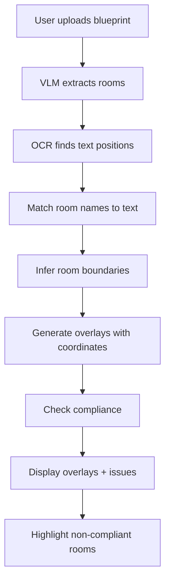

# Blueprint Extraction Testing and Dynamic Overlays Implementation Plan

## Phase 1: Test Current Branch (feature/multimodal)

### 1.1 Pre-merge Testing Checklist

**Test Blueprint Extraction Endpoint:**

- [x] Test `POST /api/blueprint/extract` with sample PDF from `backend/app/data/floor-plans/`
- [x] Verify extraction returns `BlueprintExtractionResult` with rooms, confidence scores
- [x] Test with different file types (PNG, JPG, PDF)
- [x] Test with optional `scale` parameter
- [x] Test with optional `page_index` parameter for multi-page PDFs
- [x] Verify error handling for invalid file types

**Test Frontend UI:**

- [x] Open `http://localhost:8000` (or deployed URL)
- [x] Test file upload via drag-and-drop
- [x] Test file upload via click-to-select
- [x] Verify extraction results display in table
- [x] Verify confidence scores display correctly
- [x] Test with sample PDFs from `backend/app/data/floor-plans/`

**Run Existing Tests:**

```bash
cd backend
PYTHONPATH=. pytest app/tests/test_blueprint_extractor.py -v
PYTHONPATH=. pytest app/tests/test_e2e.py -v
```

**Manual Integration Test:**

- [x] Upload `example_plan_01a.pdf` via UI
- [x] Verify extracted rooms match expected results (compare to `example_plan_01a.csv`)
- [x] Check that confidence scores are reasonable (>0.5)

### 1.2 Documentation Review

- [ ] Verify `README.md` has blueprint extraction section
- [ ] Check `.env.example` has required API keys
- [ ] Review `backend/app/tests/CURATED_PLAN_TEST_RESULTS.md` for known limitations

### 1.3 Pre-merge Checklist

- [x] All tests passing
- [ ] No uncommitted changes (`git status` clean)
- [x] Feature works end-to-end in UI
- [ ] Documentation updated

**After testing passes, you will manually:**

1. Merge `feature/multimodal` → `main`
2. Create new branch: `feature/dynamic-overlays`

---

## Phase 2: Dynamic Overlays Implementation

### 2.1 Architecture Overview



**Data Flow:**

1. User uploads blueprint → VLM extracts semantic data (name, type, area)
2. OCR extracts text positions → Find room label coordinates
3. Match VLM room names to OCR text positions
4. Infer room boundaries (heuristic: search for walls near labels)
5. Generate overlay objects with pixel coordinates
6. Check compliance on extracted rooms
7. Return overlays + issues to frontend
8. Render dynamic overlays on blueprint image

### 2.2 Dependencies

**Add to `backend/pyproject.toml`:**

```toml
"pytesseract>=0.3.10,<0.4.0",  # OCR for text positioning
"opencv-python>=4.8.0,<5.0.0",  # Image processing for boundary detection (optional)
```

**System Requirements:**

- Tesseract OCR installed on system (`apt-get install tesseract-ocr` on Linux)
- Or use `easyocr` as alternative (no system dependencies)

### 2.3 New Models

**Update `backend/app/models/domain.py`:**

Add `Overlay` model:

```python
class Overlay(BaseModel):
    """Overlay definition for room/door visualization"""
    id: str = Field(..., description="Element ID (matches Room.id or Door.id)")
    type: Literal["room", "door"] = Field(..., description="Element type")
    x: int = Field(..., ge=0, description="X coordinate in pixels")
    y: int = Field(..., ge=0, description="Y coordinate in pixels")
    width: int = Field(..., gt=0, description="Width in pixels")
    height: int = Field(..., gt=0, description="Height in pixels")
    room_name: Optional[str] = Field(None, description="Room name (for rooms)")
    room_type: Optional[str] = Field(None, description="Room type (for rooms)")
```

Update `BlueprintExtractionResult`:

```python
class BlueprintExtractionResult(BaseModel):
    # ... existing fields ...
    overlays: List[Overlay] = Field(default_factory=list, description="Generated overlays with pixel coordinates")
```

### 2.4 New Service: Overlay Generator

**Create `backend/app/services/overlay_generator.py`:**

Key functions:

- `generate_overlays_from_blueprint(image_path, extracted_rooms) -> List[Overlay]`
  - Uses OCR to find text positions
  - Matches room names to text positions
  - Infers room boundaries (heuristic approach)
  - Returns overlays with pixel coordinates

- `find_text_positions(image_path) -> List[TextPosition]`
  - Uses pytesseract/easyocr to extract text with coordinates
  - Returns list of (text, x, y, width, height)

- `match_rooms_to_text(rooms, text_positions) -> Dict[str, TextPosition]`
  - Fuzzy matching of room names to OCR text
  - Returns mapping: room_id -> text_position

- `infer_room_boundaries(image_path, text_position) -> Overlay`
  - Uses image processing to find room boundaries near text
  - Heuristic: search for walls/outlines in rectangular region
  - Returns overlay with x, y, width, height

**Implementation approach:**

1. Use `pytesseract.image_to_data()` to get text with coordinates
2. Filter for text matching room names (fuzzy match with `rapidfuzz`)
3. For each matched text, search for room boundaries:

   - Look for rectangular regions (contours) near text position
   - Use OpenCV for contour detection (optional, can use simpler heuristics)
   - Default: create overlay with estimated size based on text position + heuristics

### 2.5 Update Blueprint API

**Update `backend/app/api/blueprint.py`:**

Add new endpoint or extend existing:

```python
@router.post("/extract-and-check", response_model=dict)
async def extract_and_check_compliance(
    file: UploadFile,
    scale: Optional[float] = None,
    page_index: Optional[int] = None,
    generate_overlays: bool = True
) -> dict:
    """
    Extract rooms, generate overlays, and check compliance.
    
    Returns:
    {
        "extraction": BlueprintExtractionResult,
        "issues": List[Issue],
        "summary": dict
    }
    """
    # 1. Extract rooms (existing)
    result = extract_rooms_from_blueprint(...)
    
    # 2. Generate overlays (new)
    if generate_overlays:
        from app.services.overlay_generator import generate_overlays_from_blueprint
        overlays = generate_overlays_from_blueprint(tmp_path, result.rooms)
        result.overlays = overlays
    
    # 3. Check compliance (new)
    from app.services.compliance_checker import check_compliance
    issues = check_compliance(rooms=result.rooms, doors=[])
    
    # 4. Return combined result
    return {
        "extraction": result,
        "issues": issues,
        "summary": get_compliance_summary(issues)
    }
```

**Alternative:** Extend existing endpoint with optional parameters:

```python
@router.post("/extract", response_model=BlueprintExtractionResult)
async def extract_blueprint(
    file: UploadFile,
    scale: Optional[float] = None,
    page_index: Optional[int] = None,
    generate_overlays: bool = False,  # New parameter
    check_compliance: bool = False    # New parameter
) -> BlueprintExtractionResult | dict:
```

### 2.6 Frontend Updates

**Update `backend/app/templates/index.html`:**

0. **Update Plan Viewer to Display Uploaded Blueprint:**

   - When a file is selected in the extraction panel, display it in the plan viewer
   - Replace the static `plan.png` with the uploaded blueprint image
   - Update `handleFileSelect()` function to:
     - Use `FileReader` API to read the uploaded file as a data URL
     - For image files (PNG, JPG): Convert directly to data URL
     - For PDF files: Extract first page as image (or show placeholder until extraction completes)
     - Update `#plan-image` src to the data URL: `planImage.src = dataUrl`
   - Clear overlays when a new file is selected (reset overlay state)
   - This ensures dynamic overlays are rendered on the actual uploaded blueprint, not the static plan image

1. **Add "Check Compliance" button:**

   - After extraction results, add button: "Check Compliance & Generate Overlays"
   - Calls new endpoint or existing with `check_compliance=true`

2. **Update overlay rendering:**

   - Modify `loadOverlays()` to accept overlays from API response
   - Add `renderDynamicOverlays(overlays)` function
   - Update `renderOverlayElements()` to handle both static (from JSON) and dynamic (from API) overlays
   - Optional: add modal to view all overlays/issues if needed

3. **Update extraction flow:**

   - After extraction, show "Check Compliance" button
   - On click, call `/api/blueprint/extract-and-check` or `/api/blueprint/extract?check_compliance=true`
   - **Single panel approach:** keep only the "Extracted Rooms (Preview)" table; remove separate compliance panel
   - Add columns to the table:
     - **Confidence**: show extraction confidence per room (badge, e.g., overall or min component)
     - **Compliance**: Pass/Fail + issue count
   - For rows with issues: show tooltip or expandable row with issue messages (rule + message)
   - Optional: an "Issues (n)" badge above the table that opens a modal listing all issues
   - Render dynamic overlays on blueprint image; highlight non-compliant rooms (red overlay)

4. **JavaScript functions to add:**
   ```javascript
   function displayUploadedBlueprint(file) {
     // Read file as data URL and display in plan viewer
     const reader = new FileReader();
     reader.onload = (e) => {
       const planImage = document.getElementById("plan-image");
       planImage.src = e.target.result;
       // Clear existing overlays when new blueprint is loaded
       clearOverlays();
     };
     if (file.type.startsWith("image/")) {
       reader.readAsDataURL(file);
     } else if (file.type === "application/pdf") {
       // For PDFs, could extract first page or show placeholder
       // For now, show placeholder until extraction provides image
       // Or use PDF.js to render first page
     }
   }
   
   async function checkComplianceAndGenerateOverlays() {
     // Call API with check_compliance=true
     // Update issues list
     // Render dynamic overlays
     // Highlight non-compliant rooms
   }
   
   function renderDynamicOverlays(overlays) {
     // Similar to existing renderOverlays() but uses API data
     // Match overlays to extracted rooms
     // Create overlay divs with pixel coordinates
   }
   
   function highlightNonCompliantRooms(issues) {
     // Find overlays matching issue.element_id
     // Add 'highlighted' class (red pulsing border)
   }
   
   function clearOverlays() {
     // Clear overlay container and reset overlay state
     const container = document.getElementById("overlays-container");
     if (container) container.innerHTML = "";
     overlayElements.clear();
   }
   ```


### 2.7 Testing Strategy

**Unit Tests (`backend/app/tests/test_overlay_generator.py`):**

- Test `find_text_positions()` with sample image
- Test `match_rooms_to_text()` with known room names
- Test `infer_room_boundaries()` with mock text positions
- Test `generate_overlays_from_blueprint()` end-to-end

**Integration Tests:**

- Test new API endpoint with sample PDF
- Verify overlays are generated correctly
- Verify compliance checking works with extracted rooms
- Test frontend overlay rendering

**Manual Testing:**

- Upload sample PDF via UI
- Verify overlays appear on blueprint
- Verify non-compliant rooms highlighted in red
- Test with different blueprint styles

### 2.8 Files to Create/Modify

**New Files:**

- `backend/app/services/overlay_generator.py` - OCR + overlay generation logic
- `backend/app/tests/test_overlay_generator.py` - Unit tests

**Modified Files:**

- `backend/app/models/domain.py` - Add `Overlay` model, update `BlueprintExtractionResult`
- `backend/app/api/blueprint.py` - Add compliance checking + overlay generation
- `backend/app/templates/index.html` - Add compliance button, dynamic overlay rendering
- `backend/pyproject.toml` - Add OCR dependencies
- `README.md` - Document new feature

### 2.9 Implementation Order

1. **Add dependencies** (`pyproject.toml`)
2. **Create `Overlay` model** (`domain.py`)
3. **Create overlay generator service** (`overlay_generator.py`)
4. **Write unit tests** (`test_overlay_generator.py`)
5. **Update API endpoint** (`blueprint.py`)
6. **Update frontend** (`index.html`)
7. **Integration testing**
8. **Documentation**

### 2.10 Fallback Strategy

If OCR approach is too complex or unreliable:

- **Option B (User Interaction):** Allow users to manually draw overlays after extraction
- **Simpler approach:** Skip overlay generation, just show compliance issues in list (no visual overlays)

---

## Success Criteria

**Phase 1:**

- All tests pass
- UI works end-to-end
- Ready to merge to main

**Phase 2:**

- Overlays generated from OCR + text positioning
- Compliance checking integrated
- Non-compliant rooms highlighted in UI
- Works with sample PDFs from `backend/app/data/floor-plans/`

---

## Timeline Estimate

- **Phase 1 (Testing):** 1-2 hours
- **Phase 2 (Implementation):** 6-8 hours
  - Overlay generator: 3-4 hours
  - API integration: 1-2 hours
  - Frontend updates: 2-3 hours
  - Testing: 1 hour

**Total:** 7-10 hours