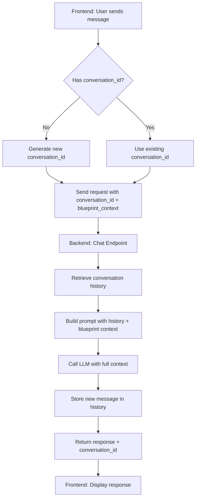

# Conversational Chat with Blueprint Context Implementation Plan

## Overview

Transform the current stateless Q&A chat into a conversational system that:

1. Maintains conversation history across messages
2. Integrates extracted blueprint room data into chat context
3. Enables follow-up questions and context-aware responses

## Architecture Changes



## Implementation Steps

### 1. Backend: Conversation Storage

**File**: `backend/app/api/chat.py`

- Add in-memory conversation storage dictionary:
  ```python
  # Global conversation storage (in-memory for MVP)
  _conversations: Dict[str, List[Dict[str, str]]] = {}
  ```

- Add helper functions:
  - `_get_conversation_history(conversation_id: str) -> List[Dict]`
  - `_save_message(conversation_id: str, role: str, content: str)`
  - `_generate_conversation_id() -> str` (UUID or timestamp-based)

### 2. Backend: Update Request/Response Models

**File**: `backend/app/api/chat.py`

**Update `ChatRequest` model**:

- Add `conversation_id: Optional[str] = None`
- Add `blueprint_context: Optional[List[Room]] = None `(import Room from `app.models.domain`)

**Update `ChatResponse` model**:

- Add `conversation_id: str` (always returned, even if newly generated)

### 3. Backend: Update Chat Endpoint

**File**: `backend/app/api/chat.py` - `chat()` function

**Changes**:

1. Generate or use `conversation_id`:

   - If not provided, generate new one
   - If provided, retrieve conversation history

2. Retrieve conversation history:

   - Call `_get_conversation_history(conversation_id)`
   - Format as LangChain message format: `[("human", msg), ("ai", response), ...]`

3. Build blueprint context string (if provided):
   ```python
   if request.blueprint_context:
       blueprint_info = "User's uploaded blueprint contains the following rooms:\n"
       for room in request.blueprint_context:
           blueprint_info += f"- {room.name} ({room.type}): {room.area_m2} m²\n"
   ```

4. Update prompt template to include:

   - Conversation history (previous messages)
   - Blueprint context (if available)
   - Current query

5. Store new messages:

   - Save user message: `_save_message(conversation_id, "human", request.query)`
   - Save AI response: `_save_message(conversation_id, "ai", answer)`

6. Return `conversation_id` in response

### 4. Backend: Update Prompt Template

**File**: `backend/app/api/chat.py` - `chat()` function

**Modify prompt construction**:

```python
messages = [
    ("system", system_prompt_with_blueprint_context),
]

# Add conversation history
if conversation_history:
    messages.extend(conversation_history)

# Add current query
messages.append(("human", current_query_with_context))
```

**Update system prompt** to mention:

- "You are having a conversation with the user about building codes"
- "The user may reference their uploaded blueprint (see blueprint context below)"
- Include blueprint context in system prompt if available

### 5. Frontend: Conversation State Management

**File**: `backend/app/templates/index.html`

**Add JavaScript variables** (near line 368 where `extractedRooms` is defined):

```javascript
let conversationId = null; // Track conversation ID
```

**Update `sendChat()` function** (around line 444):

1. Generate `conversationId` if null (use `crypto.randomUUID()` or timestamp)
2. Prepare `blueprint_context` from `extractedRooms` array:
   ```javascript
   const blueprintContext = extractedRooms.length > 0 ? extractedRooms : null;
   ```

3. Update fetch request body:
   ```javascript
   body: JSON.stringify({
     query: query,
     conversation_id: conversationId,
     blueprint_context: blueprintContext
   })
   ```

4. Store `conversation_id` from response:
   ```javascript
   conversationId = data.conversation_id;
   ```


### 6. Frontend: Optional - Conversation Reset

**File**: `backend/app/templates/index.html`

**Add "New Conversation" button** (optional enhancement):

- Button in chat panel header
- Clears `conversationId` and `extractedRooms` references
- Resets chat messages container

## Technical Details

### Conversation Storage Format

```python
_conversations = {
    "conv_123": [
        {"role": "human", "content": "What is minimum bedroom area?"},
        {"role": "ai", "content": "According to the code..."},
        {"role": "human", "content": "What about bathrooms?"},
        {"role": "ai", "content": "For bathrooms..."}
    ]
}
```

### LangChain Message Format

Convert stored messages to LangChain format:

```python
langchain_messages = [
    ("human", msg["content"]) if msg["role"] == "human" 
    else ("ai", msg["content"])
    for msg in conversation_history
]
```

### Blueprint Context Format

When `blueprint_context` is provided, include in system prompt:

```
The user has uploaded a blueprint with the following rooms:
- Bedroom 1 (bedroom): 14.5 m²
- Living Room (living): 25.0 m²
- Kitchen (kitchen): 12.0 m²
...
You can reference these specific rooms when answering questions.
```

## Testing Considerations

1. **Test conversation flow**:

   - Send first message (generates conversation_id)
   - Send follow-up message (uses same conversation_id)
   - Verify conversation history is maintained

2. **Test blueprint context**:

   - Extract rooms from blueprint
   - Ask question referencing specific room
   - Verify LLM can reference blueprint context

3. **Test edge cases**:

   - Empty conversation_id (should generate new one)
   - Invalid conversation_id (should generate new one)
   - No blueprint context (should work normally)
   - Long conversations (may need truncation for token limits)

## Future Enhancements (Out of Scope)

- Conversation persistence (Redis/database)
- Conversation expiration/cleanup
- Token limit management (truncate old messages)
- Multiple conversations per user
- Conversation export/sharing

## Files to Modify

1. `backend/app/api/chat.py`:

   - Add conversation storage
   - Update `ChatRequest` and `ChatResponse` models
   - Modify `chat()` endpoint function
   - Update prompt template

2. `backend/app/templates/index.html`:

   - Add `conversationId` variable
   - Update `sendChat()` function
   - (Optional) Add conversation reset button

## Estimated Effort

- Backend changes: 1-1.5 hours
- Frontend changes: 30-45 minutes
- Testing: 30 minutes
- **Total: 2-3 hours**