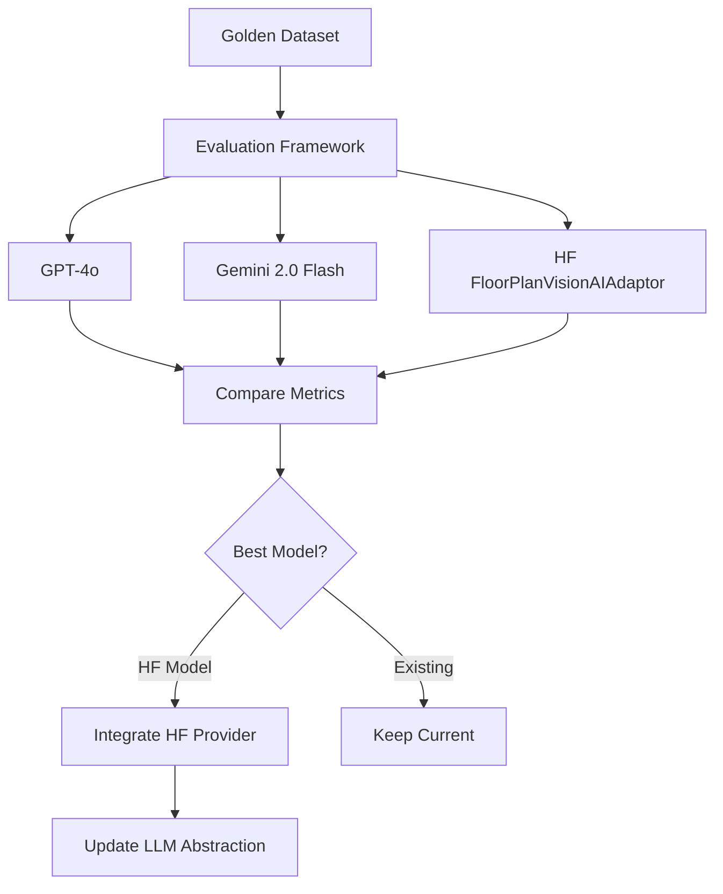

# Hugging Face VLM Integration and Evaluation Plan

## Overview

This plan evaluates and integrates the specialized Hugging Face floor plan VLM (`sabaridsnfuji/FloorPlanVisionAIAdaptor`) into the blueprint extraction system. The model is specifically trained for floor plan analysis and may offer better domain-specific performance than general-purpose VLMs.

The plan follows a two-phase approach:

1. **Evaluation Phase**: Compare the Hugging Face model against existing models (GPT-4o, Gemini 2.0 Flash) using the existing evaluation framework
2. **Integration Phase**: Integrate the model as a new provider option in the LLM abstraction layer

## Architecture



## Model Details

**Hugging Face Model**: `sabaridsnfuji/FloorPlanVisionAIAdaptor`

- **Type**: Vision-Language Model (VLM) specialized for floor plans
- **Framework**: PyTorch with `unsloth` (FastVisionModel)
- **Features**: 
  - Multi-modal input (image + text)
  - 4-bit inference support
  - Gradient checkpointing for memory efficiency
  - Domain-specific training on architectural floor plans

**Key Differences from Current Models**:

- Not LangChain-compatible out of the box
- Uses `unsloth.FastVisionModel` instead of LangChain wrappers
- Requires custom tokenizer and generation pipeline
- Returns raw tokens that need decoding

## Phase 1: Evaluation

### 1.1 Setup Hugging Face Model Wrapper

**File**: `evaluation/hf_vlm_wrapper.py` (new)

Create a wrapper that adapts the Hugging Face model to the evaluation framework interface:

```python
from unsloth import FastVisionModel
from transformers import TextStreamer
from PIL import Image
import torch

def create_hf_extractor(model_name: str = "sabaridsnfuji/FloorPlanVisionAIAdaptor"):
    """
    Create extractor function compatible with evaluation framework.
    
    Returns a function that matches the signature:
    extract_rooms_from_blueprint(image_path, scale_override) -> BlueprintExtractionResult
    """
    # Load model and tokenizer
    model, tokenizer = FastVisionModel.from_pretrained(
        model_name,
        load_in_4bit=True,
        use_gradient_checkpointing="unsloth"
    )
    FastVisionModel.for_inference(model)
    
    def extractor(image_path: str, scale_override: float = 1.0):
        # Load image
        image = Image.open(image_path)
        
        # Format prompt (adapt from blueprint_extractor._build_extraction_prompt)
        instruction = _build_extraction_prompt(scale_override)
        messages = [
            {"role": "user", "content": [
                {"type": "image"},
                {"type": "text", "text": instruction}
            ]}
        ]
        
        # Tokenize
        input_text = tokenizer.apply_chat_template(messages, add_generation_prompt=True)
        inputs = tokenizer(
            image,
            input_text,
            add_special_tokens=False,
            return_tensors="pt",
        ).to("cuda" if torch.cuda.is_available() else "cpu")
        
        # Generate
        output = model.generate(
            **inputs,
            max_new_tokens=2048,
            use_cache=True,
            temperature=0.0,  # Match current VLM settings
        )
        
        # Decode and parse
        response_text = tokenizer.decode(output[0], skip_special_tokens=True)
        # Extract JSON from response (may need parsing logic)
        # Convert to BlueprintExtractionResult
        return parse_to_extraction_result(response_text, scale_override)
    
    return extractor
```

**Challenges**:

- Response format may differ from LangChain models (may not be pure JSON)
- Need to extract JSON from model output (may include extra text)
- Device management (CUDA vs CPU)
- Memory constraints (4-bit loading helps)

### 1.2 Update Evaluation Script

**File**: `evaluation/vlm_evaluation.py`

Add Hugging Face model evaluation to the main evaluation script:

```python
# Add import
from evaluation.hf_vlm_wrapper import create_hf_extractor

# In main() function, add:
def extractor_hf(image_path: str, scale_override: float = 1.0) -> BlueprintExtractionResult:
    """Extractor function for Hugging Face FloorPlanVisionAIAdaptor"""
    extractor = create_hf_extractor()
    return extractor(image_path, scale_override)

# Evaluate Hugging Face model
if torch.cuda.is_available() or True:  # Check if GPU available
    print("\n" + "="*60)
    print("Evaluating Hugging Face FloorPlanVisionAIAdaptor...")
    print("="*60)
    try:
        result_hf = evaluate_vlm_extraction(
            extractor_func=extractor_hf,
            golden_dataset_df=golden_df,
            model_name="hf-floorplan-vision-adaptor",
            delay_between_extractions=0.5  # May be faster if local
        )
        results.append(result_hf)
    except Exception as e:
        print(f"❌ Hugging Face model evaluation failed: {e}")
else:
    print("\n⚠ GPU not available. Hugging Face model requires GPU for inference.")
```

### 1.3 Run Evaluation

**Command**:

```bash
cd backend
PYTHONPATH=. python ../evaluation/vlm_evaluation.py
```

**Expected Output**:

- Comparison table showing metrics for all three models
- Composite scores, recall, precision, area accuracy, latency
- Best model recommendation

**Metrics to Compare**:

- Composite score (primary)
- Recall (room detection)
- Precision (false positives)
- Area accuracy
- Type match rate
- Name match rate
- Semantic understanding score
- Average latency
- Cost (if applicable - HF model is free but requires GPU)

### 1.4 Document Evaluation Results

**File**: `evaluation/results/hf_model_evaluation.md` (new)

Document:

- Evaluation methodology
- Results comparison table
- Strengths/weaknesses of each model
- Recommendation for production use

## Phase 2: Integration (If HF Model Performs Well)

### 2.1 Create Hugging Face Provider in LLM Abstraction

**File**: `backend/app/core/llm.py`

Add Hugging Face provider support to `get_vision_llm()`:

```python
def get_vision_llm(
    provider: Optional[str] = None,
    model_name: Optional[str] = None
) -> BaseChatModel:
    # ... existing code ...
    
    elif provider == "huggingface" or provider == "hf":
        # Import here to avoid dependency if not using HF
        from app.core.hf_vlm_adapter import HuggingFaceVisionAdapter
        
        # Get model name (default to floor plan model)
        model = model_name or "sabaridsnfuji/FloorPlanVisionAIAdaptor"
        
        # Create adapter that wraps HF model in LangChain-compatible interface
        return HuggingFaceVisionAdapter(model_name=model)
    
    else:
        raise ValueError(f"Unsupported vision LLM provider: {provider}")
```

### 2.2 Create LangChain-Compatible Adapter

**File**: `backend/app/core/hf_vlm_adapter.py` (new)

Create an adapter class that makes the Hugging Face model compatible with LangChain's `BaseChatModel` interface:

```python
from typing import List, Optional, Any, Dict
from langchain_core.language_models import BaseChatModel
from langchain_core.messages import BaseMessage, HumanMessage
from langchain_core.outputs import ChatGeneration, ChatResult
from langchain_core.callbacks import CallbackManagerForLLMRun
from unsloth import FastVisionModel
from transformers import AutoTokenizer
from PIL import Image
import torch
import base64
import io
import json
import re

class HuggingFaceVisionAdapter(BaseChatModel):
    """
    Adapter that wraps Hugging Face FastVisionModel in LangChain-compatible interface.
    
    This allows the specialized floor plan VLM to be used seamlessly with existing
    blueprint extraction code.
    """
    
    model_name: str
    model: Any = None
    tokenizer: Any = None
    device: str = "cuda" if torch.cuda.is_available() else "cpu"
    temperature: float = 0.0
    max_new_tokens: int = 2048
    
    def __init__(self, model_name: str, **kwargs):
        super().__init__(**kwargs)
        self.model_name = model_name
        self._load_model()
    
    def _load_model(self):
        """Load model and tokenizer."""
        self.model, self.tokenizer = FastVisionModel.from_pretrained(
            self.model_name,
            load_in_4bit=True,
            use_gradient_checkpointing="unsloth"
        )
        FastVisionModel.for_inference(self.model)
        self.model = self.model.to(self.device)
    
    def _extract_image_from_message(self, message: HumanMessage) -> Optional[Image.Image]:
        """Extract PIL Image from LangChain HumanMessage content."""
        if not isinstance(message, HumanMessage):
            return None
        
        content = message.content
        if isinstance(content, list):
            for item in content:
                if isinstance(item, dict) and item.get("type") == "image_url":
                    image_url = item.get("image_url", {}).get("url", "")
                    if image_url.startswith("data:image"):
                        # Base64 encoded image
                        header, encoded = image_url.split(",", 1)
                        image_data = base64.b64decode(encoded)
                        return Image.open(io.BytesIO(image_data))
        return None
    
    def _extract_text_from_message(self, message: HumanMessage) -> str:
        """Extract text prompt from LangChain HumanMessage content."""
        content = message.content
        if isinstance(content, str):
            return content
        elif isinstance(content, list):
            text_parts = []
            for item in content:
                if isinstance(item, dict) and item.get("type") == "text":
                    text_parts.append(item.get("text", ""))
            return " ".join(text_parts)
        return ""
    
    def _invoke(
        self,
        messages: List[BaseMessage],
        stop: Optional[List[str]] = None,
        run_manager: Optional[CallbackManagerForLLMRun] = None,
        **kwargs: Any,
    ) -> ChatResult:
        """Invoke the model with messages."""
        # Extract image and text from messages
        image = None
        text_prompt = ""
        
        for message in messages:
            if isinstance(message, HumanMessage):
                img = self._extract_image_from_message(message)
                if img:
                    image = img
                text_prompt += self._extract_text_from_message(message)
        
        if image is None:
            raise ValueError("Hugging Face VLM requires an image in the message")
        
        # Format for HF model
        messages_hf = [
            {"role": "user", "content": [
                {"type": "image"},
                {"type": "text", "text": text_prompt}
            ]}
        ]
        
        # Tokenize
        input_text = self.tokenizer.apply_chat_template(
            messages_hf,
            add_generation_prompt=True
        )
        inputs = self.tokenizer(
            image,
            input_text,
            add_special_tokens=False,
            return_tensors="pt",
        ).to(self.device)
        
        # Generate
        with torch.no_grad():
            output = self.model.generate(
                **inputs,
                max_new_tokens=self.max_new_tokens,
                use_cache=True,
                temperature=self.temperature,
            )
        
        # Decode
        response_text = self.tokenizer.decode(output[0], skip_special_tokens=True)
        
        # Extract JSON if present (HF model may return extra text)
        json_match = re.search(r'\{.*\}', response_text, re.DOTALL)
        if json_match:
            response_text = json_match.group(0)
        
        # Create ChatResult
        generation = ChatGeneration(message=HumanMessage(content=response_text))
        return ChatResult(generations=[generation])
    
    @property
    def _llm_type(self) -> str:
        return "huggingface_vision"
```

### 2.3 Update Dependencies

**File**: `backend/pyproject.toml`

Add required dependencies:

```toml
"unsloth[colab-new]>=2024.8",  # For FastVisionModel
"transformers>=4.40.0",  # For tokenizer
"torch>=2.0.0",  # PyTorch (may already be present)
"bitsandbytes>=0.41.0",  # For 4-bit quantization
```

**Note**: `unsloth` may have specific installation requirements. Check model documentation.

### 2.4 Update Environment Configuration

**File**: `backend/.env.example`

Add optional Hugging Face configuration:

```bash
# Optional: Hugging Face VLM (requires GPU)
# VISION_LLM_PROVIDER=huggingface
# HF_VLM_MODEL=sabaridsnfuji/FloorPlanVisionAIAdaptor
```

### 2.5 Update Blueprint Extractor

**File**: `backend/app/services/blueprint_extractor.py`

No changes needed if adapter works correctly - existing code should work with new provider.

**Optional**: Add provider-specific optimizations or prompt adjustments if HF model responds differently.

### 2.6 Add Tests

**File**: `backend/app/tests/test_hf_vlm_adapter.py` (new)

Test the adapter:

- Image + text message handling
- JSON extraction from response
- Error handling (no image, invalid format)
- Device fallback (CPU if no GPU)

## Implementation Order

1. **Phase 1: Evaluation**

   - Create `evaluation/hf_vlm_wrapper.py`
   - Update `evaluation/vlm_evaluation.py` to include HF model
   - Run evaluation and document results
   - Compare metrics and determine if integration is worthwhile

2. **Phase 2: Integration** (only if evaluation shows promise)

   - Create `backend/app/core/hf_vlm_adapter.py`
   - Update `backend/app/core/llm.py` to add HF provider
   - Update `backend/pyproject.toml` with dependencies
   - Test integration with blueprint extraction
   - Update documentation

## Challenges and Considerations

### Technical Challenges

1. **Response Format**: HF model may return free-form text with JSON embedded, not pure JSON

   - **Solution**: Use regex to extract JSON from response, add fallback parsing

2. **Memory Requirements**: Model requires GPU and significant VRAM

   - **Solution**: Use 4-bit quantization, gradient checkpointing, document GPU requirements

3. **Latency**: Local inference may be slower than API calls

   - **Solution**: Benchmark and document, consider async processing

4. **Device Management**: Need to handle CPU fallback gracefully

   - **Solution**: Check GPU availability, provide clear error messages

### Operational Considerations

1. **Cost**: HF model is free but requires GPU infrastructure

   - Compare with API costs for GPT-4o/Gemini

2. **Reliability**: Local model vs. API reliability

   - Consider deployment complexity

3. **Maintenance**: Model updates, dependency management

   - Document update process

## Success Criteria

**Phase 1 (Evaluation)**:

- [ ] HF model wrapper successfully extracts rooms from test blueprints
- [ ] Evaluation completes without errors
- [ ] Comparison table shows all metrics for all three models
- [ ] Results documented with recommendations

**Phase 2 (Integration)**:

- [ ] HF adapter integrates seamlessly with existing code
- [ ] Blueprint extraction works with `provider="huggingface"`
- [ ] Tests pass for adapter
- [ ] Documentation updated with usage instructions
- [ ] Performance matches or exceeds evaluation results

## Future Enhancements

- Fine-tune HF model on project-specific floor plans
- Add support for other specialized floor plan VLMs
- Create hybrid approach (use HF for initial extraction, GPT-4o for validation)
- Add model selection logic based on blueprint characteristics