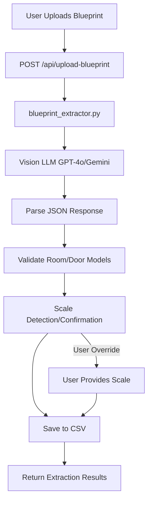
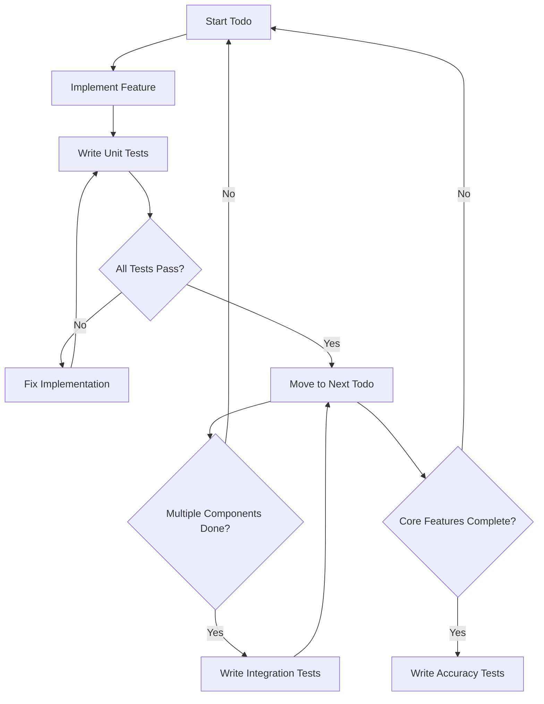

# Multimodal Blueprint Extraction Implementation Plan

## Overview

Add multimodal AI capability to extract room and door data directly from architectural blueprint images, eliminating manual CSV creation. The system will:

1. Accept image uploads (PNG, JPG, PDF)
2. Use vision LLM to extract structured data
3. Auto-detect scale with user override option
4. Validate extracted data
5. Save to CSV (user chooses overwrite or new file)
6. Target >90% accuracy for room areas, >95% for door widths

## Architecture Flow



## Implementation Phases

### Phase 1: Core Extraction Service (2-3 days)

#### 1.1 Update LLM Client for Vision Support

**File**: `backend/app/core/llm.py`

- Add `get_vision_llm()` function supporting multimodal models
- Support GPT-4o (recommended: cheaper than GPT-4 Vision, accurate) and Gemini 1.5 Flash Vision (very cheap alternative)
- Use environment variable `VISION_LLM_PROVIDER` (default: "openai")
- Model selection:
  - OpenAI: `gpt-4o` (cost: ~$0.005-0.015 per image, accurate)
  - Gemini: `gemini-1.5-flash` (cost: ~$0.0001-0.001 per image, good accuracy)

**Key changes**:

```python
def get_vision_llm(provider: str = None, model_name: Optional[str] = None) -> BaseChatModel:
    """Get vision-capable LLM for image processing."""
    provider = provider or os.getenv("VISION_LLM_PROVIDER", "openai")
    
    if provider == "openai":
        # Use gpt-4o (cheaper than gpt-4-vision-preview, still accurate)
        model = model_name or "gpt-4o"
        return ChatOpenAI(model=model, temperature=0.0)
    
    elif provider == "gemini":
        # Use Gemini 1.5 Flash Vision (very cheap)
        from langchain_google_genai import ChatGoogleGenerativeAI
        model = model_name or "gemini-1.5-flash"
        return ChatGoogleGenerativeAI(model=model, temperature=0.0)
```

#### 1.2 Create Blueprint Extractor Service

**New file**: `backend/app/services/blueprint_extractor.py`

**Responsibilities**:

- Accept image file path (PNG, JPG, PDF)
- Convert to base64 for LLM API
- Handle PDF extraction (convert first page to image)
- Call vision LLM with structured extraction prompt
- Parse JSON response into Room/Door models
- Validate extracted data
- Auto-detect scale from image
- Apply scale corrections if needed

**Key functions**:

```python
def extract_from_blueprint(
    image_path: str | Path,
    scale_override: Optional[float] = None,
    level: int = 1
) -> BlueprintExtractionResult:
    """
    Extract rooms and doors from blueprint image.
    
    Returns:
        BlueprintExtractionResult with rooms, doors, detected_scale, confidence_scores
    """
```

**Structured extraction prompt**:

- Request JSON output matching Room/Door schema
- Include scale detection instructions
- Request confidence scores for each extracted value
- Specify SI units (m² for areas, mm for widths)
- Handle room type inference (BR → bedroom, LR → living, etc.)

**Scale detection strategy**:

1. Look for scale indicators in image (e.g., "1:100", "SCALE: 1/4\" = 1'-0\"")
2. Use known reference dimensions if present
3. If not found, prompt user for scale input
4. Apply scale factor to all dimensions

**PDF handling**:

- Use PyMuPDF (already in dependencies) to extract first page as image
- Convert PDF page to PNG at 300 DPI for clarity

#### 1.3 Create Extraction Result Model

**File**: `backend/app/models/domain.py`

Add new Pydantic models:

```python
class ExtractionConfidence(BaseModel):
    """Confidence scores for extracted values."""
    room_id: str
    area_confidence: float  # 0.0-1.0
    type_confidence: float
    # ... for each extracted field

class BlueprintExtractionResult(BaseModel):
    """Result of blueprint extraction."""
    rooms: List[Room]
    doors: List[Door]
    detected_scale: Optional[float]  # e.g., 1.0 for 1:100, 0.5 for 1:200
    scale_source: Literal["auto-detected", "user-provided", "assumed"]
    confidence_scores: List[ExtractionConfidence]
    warnings: List[str]  # e.g., "Could not detect scale, assuming 1:100"
    extraction_metadata: dict  # Model used, timestamp, etc.
```

### Phase 2: API Endpoint (1 day)

#### 2.1 Create Upload Endpoint

**New file**: `backend/app/api/blueprint.py`

**Endpoint**: `POST /api/blueprint/upload`

**Request**:

- `file`: UploadFile (image or PDF)
- `scale_override`: Optional[float] - User-provided scale if auto-detection fails
- `level`: int = 1 - Floor level for extracted rooms/doors
- `save_mode`: Literal["overwrite", "new_file"] - How to save CSV

**Response**:

```python
class BlueprintUploadResponse(BaseModel):
    extraction_result: BlueprintExtractionResult
    csv_files_created: List[str]  # Paths to created CSV files
    validation_errors: List[str]  # Any validation issues
    success: bool
```

**Implementation**:

- Accept file upload using FastAPI's `UploadFile`
- Save uploaded file temporarily
- Call `blueprint_extractor.extract_from_blueprint()`
- Validate extracted Room/Door models
- Save to CSV based on `save_mode`
- Clean up temporary file
- Return extraction results

**File handling**:

- Save uploads to `backend/app/data/uploads/` (create if missing)
- Generate unique filename: `blueprint_{timestamp}_{random}.{ext}`
- Clean up after processing (or keep for debugging)

#### 2.2 CSV Writer Service

**New file**: `backend/app/services/csv_writer.py`

**Function**: `save_extraction_to_csv(rooms, doors, save_mode, output_dir)`

- If `save_mode == "overwrite"`: Write to `rooms.csv` and `doors.csv`
- If `save_mode == "new_file"`: Create timestamped files
- Validate data before writing
- Preserve existing CSV format (headers, column order)

**Mount router in** `backend/app/main.py`:

```python
from app.api.blueprint import router as blueprint_router
app.include_router(blueprint_router)
```

### Phase 3: Frontend Integration (1-2 days)

#### 3.1 Update HTML Template

**File**: `backend/app/templates/index.html`

**Add upload section**:

- File input with drag-and-drop support
- Scale input field (optional, shown if auto-detection fails)
- Save mode selector (overwrite vs. new file)
- Extraction status indicator (loading, success, error)
- Preview extracted data in table before confirming
- "Confirm and Save" button

**UI Flow**:

1. User uploads image
2. Show loading spinner
3. Display extraction results with confidence scores
4. Show warnings (e.g., "Scale not detected, please confirm")
5. Allow user to edit extracted values if needed
6. User selects save mode and confirms
7. Show success message with CSV file paths

#### 3.2 JavaScript for Upload

**Add to** `backend/app/templates/index.html`:

```javascript
async function uploadBlueprint(file, scaleOverride, saveMode) {
    const formData = new FormData();
    formData.append('file', file);
    if (scaleOverride) formData.append('scale_override', scaleOverride);
    formData.append('save_mode', saveMode);
    
    const response = await fetch('/api/blueprint/upload', {
        method: 'POST',
        body: formData
    });
    
    const result = await response.json();
    // Display results, allow editing, then confirm save
}
```

#### 3.3 Update CSS

**File**: `backend/app/static/styles.css`

- Add styles for file upload area
- Style extraction results table
- Add confidence score indicators (color-coded)
- Loading states and error messages

### Phase 4: Validation & Accuracy (1-2 days)

#### 4.1 Extraction Validation

**In** `backend/app/services/blueprint_extractor.py`:

- Validate all required fields present
- Check numeric ranges (areas > 0, widths > 0)
- Validate room type values (bedroom, living, etc.)
- Check door room references exist
- Flag low-confidence extractions (< 0.7)

#### 4.2 Accuracy Testing

**Create test suite**: `backend/app/tests/test_blueprint_extraction.py`

- Test on 3-5 different blueprint images
- Measure accuracy:
  - Room area accuracy (target: >90%)
  - Door width accuracy (target: >95%)
  - Room type inference accuracy
- Document results and edge cases

**Test images**:

- Simple residential plan (1 floor, 4-5 rooms)
- Complex multi-room plan
- Plan with unclear scale indicators
- Plan with handwritten annotations

#### 4.3 Error Handling

- Handle unsupported image formats gracefully
- Handle LLM API errors (rate limits, timeouts)
- Handle malformed JSON responses
- Provide clear error messages to user

### Phase 5: Dependencies & Configuration (0.5 day)

#### 5.1 Add Dependencies

**File**: `backend/pyproject.toml`

Add if using Gemini:

```toml
"langchain-google-genai>=0.1.0",  # For Gemini Vision support
```

**Note**: OpenAI support already available via `langchain-openai`

#### 5.2 Environment Variables

**File**: `backend/.env.example`

Add:

```bash
# Vision LLM Provider (openai or gemini)
VISION_LLM_PROVIDER=openai

# Optional: Gemini API key (if using Gemini)
GOOGLE_API_KEY=your_key_here
```

#### 5.3 Update Documentation

**Files to update**:

- `README.md` - Add blueprint upload section
- `memory-bank/systemPatterns.md` - Document blueprint extraction pattern
- `memory-bank/activeContext.md` - Update current focus

## Technical Decisions

### Model Selection

**Recommended**: GPT-4o (OpenAI)

- Cost: ~$0.005-0.015 per image
- Accuracy: High (meets >90% area, >95% width targets)
- Fast: ~5-15 seconds per image
- Structured output: Excellent JSON parsing

**Alternative**: Gemini 1.5 Flash Vision

- Cost: ~$0.0001-0.001 per image (10x cheaper)
- Accuracy: Good (may need testing to verify targets)
- Fast: ~3-10 seconds per image
- Requires: `GOOGLE_API_KEY` environment variable

### Scale Detection Strategy

1. **Auto-detect from image**:

   - Look for text patterns: "1:100", "SCALE 1/4\"", "1/4\" = 1'-0\""
   - Use LLM to identify scale indicators
   - Extract numeric scale factor

2. **User override**:

   - If auto-detection fails or confidence < 0.8, prompt user
   - Show detected scale with "Confirm" or "Override" option
   - User can input scale manually (e.g., "1:100" → scale factor 1.0)

3. **Default assumption**:

   - If no scale found and user doesn't provide: assume 1:100 (common for residential)
   - Show warning: "Scale not detected, assuming 1:100. Please verify extracted dimensions."

### CSV Saving Strategy

- **Overwrite mode**: Replace existing `rooms.csv` and `doors.csv`
  - Backup existing files first (rename to `rooms_backup_{timestamp}.csv`)
- **New file mode**: Create `rooms_{timestamp}.csv` and `doors_{timestamp}.csv`
  - User can manually rename/use later
  - Prevents accidental data loss

## File Structure

```
backend/app/
├── api/
│   └── blueprint.py          # NEW: Upload endpoint
├── services/
│   ├── blueprint_extractor.py  # NEW: Core extraction logic
│   └── csv_writer.py           # NEW: CSV saving logic
├── models/
│   └── domain.py              # UPDATE: Add extraction models
├── core/
│   └── llm.py                 # UPDATE: Add vision LLM support
└── data/
    └── uploads/               # NEW: Temporary upload storage
```

## Testing Strategy

### Overview

Use a **test-as-you-go** approach: write unit tests immediately after each todo implementation, integration tests after related components are complete, and accuracy tests after all core functionality is done.

### Testing Workflow



### Test Timing by Todo

| Todo | When to Write Tests | Test Type | Test File |

|------|---------------------|-----------|-----------|

| `vision-llm-support` | Immediately after implementation | Unit | `test_llm_vision.py` |

| `extraction-models` | Immediately after adding models | Unit | `test_extraction_models.py` |

| `blueprint-extractor` | As you implement each function | Unit | `test_blueprint_extractor.py` |

| `csv-writer` | Immediately after implementation | Unit | `test_csv_writer.py` |

| `upload-endpoint` | After endpoint complete | Integration | `test_blueprint_api.py` |

| `frontend-upload-ui` | After UI complete | Integration (manual + automated) | Manual + `test_blueprint_api.py` |

| `frontend-js` | After JS complete | Integration | `test_blueprint_api.py` |

| `validation-logic` | As you implement validation | Unit | `test_blueprint_extractor.py` |

| `accuracy-testing` | After all core features done | E2E Accuracy | `test_blueprint_accuracy.py` |

| `dependencies-config` | After config complete | Manual verification | N/A |

### Detailed Test Plan by Todo

#### 1. `vision-llm-support` → Unit Tests

**File**: `backend/app/tests/test_llm_vision.py`

**Write tests immediately after implementing `get_vision_llm()`**

**Test cases**:

- Test OpenAI provider returns `ChatOpenAI` with correct model (`gpt-4o`)
- Test Gemini provider returns `ChatGoogleGenerativeAI` with correct model (if implemented)
- Test environment variable `VISION_LLM_PROVIDER` fallback (defaults to "openai")
- Test invalid provider raises `ValueError`
- Test custom model name override works
- Test temperature parameter is passed correctly

#### 2. `extraction-models` → Unit Tests

**File**: `backend/app/tests/test_extraction_models.py`

**Write tests immediately after adding models to `domain.py`**

**Test cases**:

- Test `ExtractionConfidence` validation (room_id required, confidence scores 0.0-1.0)
- Test `BlueprintExtractionResult` validation (rooms, doors required)
- Test `detected_scale` can be None
- Test `scale_source` accepts only valid literals
- Test `confidence_scores` list validation
- Test `warnings` list validation
- Test `extraction_metadata` dict validation

#### 3. `blueprint-extractor` → Unit Tests

**File**: `backend/app/tests/test_blueprint_extractor.py`

**Write tests as you implement each function**

**Test cases**:

- **Image conversion**:
  - Test PNG to base64 conversion
  - Test JPG to base64 conversion
  - Test PDF first page extraction (using PyMuPDF)
  - Test PDF to PNG conversion at 300 DPI
  - Test unsupported file format raises error

- **LLM interaction** (mock LLM responses):
  - Test structured prompt includes all required fields
  - Test JSON response parsing
  - Test malformed JSON handling
  - Test missing fields in response handling

- **Scale detection**:
  - Test auto-detection of "1:100" scale indicator
  - Test auto-detection of "SCALE 1/4\"" format
  - Test auto-detection of "1/4\" = 1'-0\"" format
  - Test scale factor calculation (1:100 → 1.0, 1:200 → 0.5)
  - Test user override takes precedence
  - Test default assumption (1:100) when no scale found

- **Data extraction**:
  - Test Room model creation from extracted data
  - Test Door model creation from extracted data
  - Test room type inference (BR → bedroom, LR → living)
  - Test area calculation from dimensions
  - Test door width extraction in mm

- **Validation**:
  - Test required fields validation
  - Test numeric range validation (areas > 0, widths > 0)
  - Test room type validation
  - Test door room reference validation
  - Test low-confidence flagging (< 0.7)

#### 4. `csv-writer` → Unit Tests

**File**: `backend/app/tests/test_csv_writer.py`

**Write tests immediately after implementation**

**Test cases**:

- Test overwrite mode creates backup files (`rooms_backup_{timestamp}.csv`)
- Test overwrite mode writes to `rooms.csv` and `doors.csv`
- Test new file mode creates timestamped files
- Test CSV format matches existing structure (headers, column order)
- Test data validation before writing (invalid data rejected)
- Test file creation in correct directory
- Test error handling for write failures

#### 5. `upload-endpoint` → Integration Tests

**File**: `backend/app/tests/test_blueprint_api.py`

**Write tests after endpoint is complete**

**Test cases**:

- Test file upload accepts PNG files
- Test file upload accepts JPG files
- Test file upload accepts PDF files
- Test invalid file types rejected (e.g., .txt, .docx)
- Test `scale_override` parameter passed correctly
- Test `save_mode` parameter ("overwrite" vs "new_file")
- Test `level` parameter defaults to 1
- Test successful extraction returns `BlueprintUploadResponse`
- Test error handling for missing file
- Test error handling for invalid extraction data
- Test temporary file cleanup after processing
- Test file size limits (if implemented)

#### 6. `frontend-upload-ui` + `frontend-js` → Integration Tests

**File**: Manual testing + `test_blueprint_api.py` (for API integration)

**Write tests after frontend is complete**

**Manual test cases**:

- Test drag-and-drop file upload works
- Test file picker button works
- Test scale input field appears when auto-detection fails
- Test save mode selector (overwrite vs new file)
- Test loading spinner displays during extraction
- Test extraction results table displays correctly
- Test confidence scores display with color coding
- Test warnings display correctly
- Test "Confirm and Save" button works
- Test success message displays with CSV file paths
- Test error messages display correctly

**Automated test cases** (API integration):

- Test frontend JavaScript calls correct API endpoint
- Test form data includes all required fields
- Test error handling in JavaScript (network errors, API errors)

#### 7. `validation-logic` → Unit Tests

**File**: `backend/app/tests/test_blueprint_extractor.py` (add to existing file)

**Write tests as you implement validation**

**Test cases**:

- Test validation catches missing required fields
- Test validation catches invalid numeric ranges
- Test validation catches invalid room types
- Test validation catches invalid door room references
- Test confidence scoring calculation
- Test low-confidence warnings generated (< 0.7)
- Test validation errors included in response

#### 8. `accuracy-testing` → E2E Accuracy Tests

**File**: `backend/app/tests/test_blueprint_accuracy.py`

**Write tests after all core features are complete**

**Test cases** (test on 3-5 real blueprint images):

- Test simple residential plan (1 floor, 4-5 rooms)
  - Measure room area accuracy (target: >90%)
  - Measure door width accuracy (target: >95%)
  - Measure room type inference accuracy
- Test complex multi-room plan
  - Measure accuracy with more rooms/doors
  - Test scale detection accuracy
- Test plan with unclear scale indicators
  - Test fallback to user input
  - Test default assumption accuracy
- Test plan with handwritten annotations
  - Test extraction handles annotations
  - Measure accuracy impact

**Accuracy measurement**:

- Calculate percentage error: `|extracted - actual| / actual * 100`
- Document results in test file
- Track which extractions fail and why

#### 9. `dependencies-config` → Manual Verification

**No automated tests needed**

**Verification checklist**:

- [ ] `pyproject.toml` includes required dependencies
- [ ] `.env.example` includes new environment variables
- [ ] Documentation updated (README.md, memory-bank files)
- [ ] Environment variables work correctly (test locally)

### Test File Structure

```
backend/app/tests/
├── test_llm_vision.py           # Unit tests for vision-llm-support
├── test_extraction_models.py    # Unit tests for extraction-models
├── test_blueprint_extractor.py  # Unit tests for blueprint-extractor + validation-logic
├── test_csv_writer.py           # Unit tests for csv-writer
├── test_blueprint_api.py        # Integration tests for upload-endpoint + frontend
├── test_blueprint_accuracy.py   # E2E accuracy tests (real blueprints)
└── test_blueprint_integration.py # End-to-end integration tests (optional)
```

### Test Execution Strategy

1. **During development**: Run unit tests after each todo completion
   ```bash
   pytest backend/app/tests/test_llm_vision.py -v
   pytest backend/app/tests/test_blueprint_extractor.py -v
   ```

2. **Before committing**: Run all tests
   ```bash
   pytest backend/app/tests/ -v
   ```

3. **Before accuracy testing**: Ensure all unit and integration tests pass
   ```bash
   pytest backend/app/tests/ --ignore=test_blueprint_accuracy.py -v
   ```

4. **Accuracy testing**: Run separately (requires real blueprint images and API keys)
   ```bash
   pytest backend/app/tests/test_blueprint_accuracy.py -v
   ```


### Test Data Requirements

- **Unit tests**: Use mock LLM responses, sample images (can be simple test images)
- **Integration tests**: Use sample blueprint images (PNG, JPG, PDF)
- **Accuracy tests**: Use 3-5 real architectural blueprint images with known ground truth data

### Error Handling Tests

**Test error scenarios**:

- Invalid image formats
- Corrupted image files
- LLM API errors (rate limits, timeouts)
- Malformed JSON responses from LLM
- Missing required fields in extraction
- Invalid scale values
- File write failures
- Network errors in frontend

### Success Criteria for Testing

- [ ] All unit tests pass (>90% code coverage for new code)
- [ ] All integration tests pass
- [ ] Accuracy tests show >90% room area accuracy
- [ ] Accuracy tests show >95% door width accuracy
- [ ] Error handling tests cover all error scenarios
- [ ] Test documentation is clear and complete

## Success Criteria

- [ ] Can upload PNG, JPG, and PDF blueprint images
- [ ] Extracts rooms with >90% area accuracy
- [ ] Extracts doors with >95% width accuracy
- [ ] Auto-detects scale or prompts user for input
- [ ] Saves extracted data to CSV (overwrite or new file)
- [ ] Shows confidence scores and warnings
- [ ] Handles errors gracefully
- [ ] Works with existing compliance checker (no breaking changes)

## Estimated Timeline

- **Phase 1**: 2-3 days (Core extraction service)
- **Phase 2**: 1 day (API endpoint)
- **Phase 3**: 1-2 days (Frontend integration)
- **Phase 4**: 1-2 days (Validation & testing)
- **Phase 5**: 0.5 day (Dependencies & docs)

**Total**: 5.5-8.5 days

## Risks & Mitigation

1. **Accuracy below targets**:

   - Mitigation: Test early, iterate on prompts, consider fine-tuning
   - Fallback: Allow manual correction before saving

2. **High API costs**:

   - Mitigation: Use Gemini for testing, cache results, batch processing
   - Fallback: Add rate limiting, require API key for users

3. **PDF parsing issues**:

   - Mitigation: Use PyMuPDF (already in dependencies), test on various PDFs
   - Fallback: Require PNG/JPG conversion for PDFs

4. **Scale detection failures**:

   - Mitigation: Multiple detection strategies, clear user prompts
   - Fallback: Always allow manual override

## Next Steps After Implementation

1. Test on multiple blueprint types (residential, commercial, etc.)
2. Collect accuracy metrics and improve prompts
3. Add batch processing (multiple images at once)
4. Add visual preview (overlay extracted rooms on image)
5. Add interactive correction UI (click to edit extracted values)