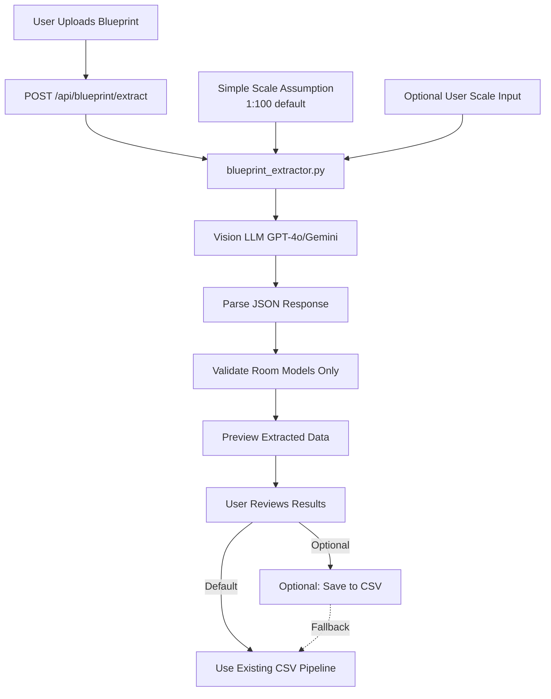
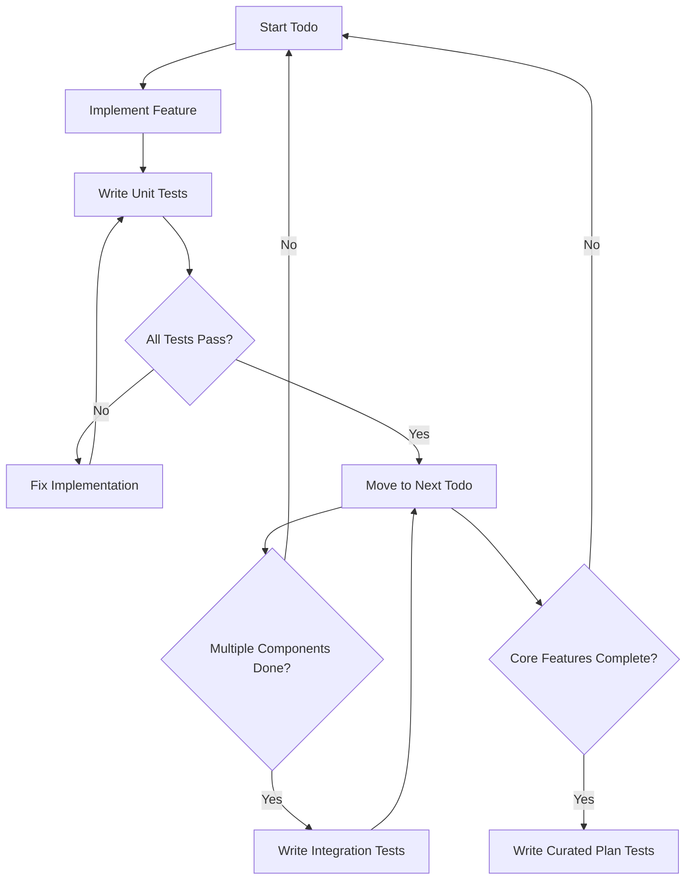

# Multimodal Blueprint Extraction Implementation Plan

## Overview

Add multimodal AI capability to extract **room-level data only** (name + approximate area) from **curated architectural blueprint images** using **geometry understanding with scale**. The Vision LLM analyzes the blueprint's visual geometry (room boundaries, shapes, dimensions) and applies scale to calculate real-world areas - not just text extraction (OCR). This is a proof-of-concept feature that demonstrates the value of vision-based extraction while keeping the CSV pipeline as the reliable ground truth.

**Scoped Approach:**

1. Extract **rooms only** (name + approx_area_m2) - no door extraction
2. Work with **curated plans** (2-3 known-good blueprints) - not general purpose
3. **Preview-only** extraction results - CSV pipeline remains primary
4. **Simple scale assumption** (1:100 default, optional manual input) - no complex auto-detection
5. **Acknowledge limitations** - demo shows concept, not perfection

**Why This Scope:**

- Faster implementation (3-4 days vs 5.5-8.5 days)
- Lower risk (CSV always works for demo)
- Honest demo (shows concept, acknowledges limitations)
- Focused value (proves multimodal extraction without over-engineering)

## Architecture Flow



## Implementation Phases

### Phase 1: Core Extraction Service (1-1.5 days)

#### 1.1 Update LLM Client for Vision Support

**File**: `backend/app/core/llm.py`

- Add `get_vision_llm()` function supporting multimodal models
- Support GPT-4o (recommended: cheaper than GPT-4 Vision, accurate) and Gemini 1.5 Flash Vision (very cheap alternative)
- Use environment variable `VISION_LLM_PROVIDER` (default: "openai")
- Model selection:
                                                                                                                                - OpenAI: `gpt-4o` (cost: ~$0.005-0.015 per image, accurate)
                                                                                                                                - Gemini: `gemini-1.5-flash` (cost: ~$0.0001-0.001 per image, good accuracy)

**Key changes**:

```python
def get_vision_llm(provider: str = None, model_name: Optional[str] = None) -> BaseChatModel:
    """Get vision-capable LLM for image processing."""
    provider = provider or os.getenv("VISION_LLM_PROVIDER", "openai")
    
    if provider == "openai":
        # Use gpt-4o (cheaper than gpt-4-vision-preview, still accurate)
        model = model_name or "gpt-4o"
        return ChatOpenAI(model=model, temperature=0.0)
    
    elif provider == "gemini":
        # Use Gemini 1.5 Flash Vision (very cheap)
        from langchain_google_genai import ChatGoogleGenerativeAI
        model = model_name or "gemini-1.5-flash"
        return ChatGoogleGenerativeAI(model=model, temperature=0.0)
```

#### 1.2 Create Blueprint Extractor Service

**New file**: `backend/app/services/blueprint_extractor.py`

**Responsibilities**:

- Accept image file path (PNG, JPG, PDF)
- Convert to base64 for LLM API
- Handle PDF extraction (convert first page to image)
- Call vision LLM with structured extraction prompt that instructs **geometry understanding**
- Parse JSON response into Room models only (no doors)
- Validate extracted data (basic validation)
- Use simple scale assumption (1:100 default, optional user input)

**Key capability**: The Vision LLM performs **geometry understanding**, not just text extraction:

- Identifies room boundaries visually (walls, lines, shapes)
- Measures room dimensions from the visual representation
- Applies scale (1:100) to convert to real-world units
- Calculates approximate areas from geometry
- Also reads room labels/names (text extraction) for identification

**Key functions**:

```python
def extract_rooms_from_blueprint(
    image_path: str | Path,
    scale_override: Optional[float] = None,
    level: int = 1
) -> BlueprintExtractionResult:
    """
    Extract rooms (name + approx_area_m2) from blueprint image.
    
    Returns:
        BlueprintExtractionResult with rooms only, no doors
    """
```

**Structured extraction prompt** (geometry understanding approach):

```python
prompt = """
Analyze this architectural floor plan blueprint and extract room information using GEOMETRY UNDERSTANDING:

1. **Identify rooms visually**: Look at the room boundaries (walls, lines, shapes) to identify each room
2. **Read room labels**: Extract room names from text labels (e.g., "BR1", "Bedroom 1", "Living Room")
3. **Measure geometry**: Measure the room dimensions (length, width) from the visual representation
4. **Apply scale**: Use the provided scale (1:100) to convert measurements to real-world units
   - If scale is 1:100, multiply blueprint measurements by 100 to get real-world meters
5. **Calculate areas**: Calculate approximate area in m² from the room dimensions (length × width)

For each room, provide:
- id: Unique identifier (e.g., "R101")
- name: Room name from label or inferred from context (e.g., "Bedroom 1", "Living Room")
- type: Room type inferred from name/label (bedroom, living, bathroom, kitchen, etc.)
- area_m2: Approximate area calculated from geometry using the scale

Important:
- Focus on GEOMETRY MEASUREMENT, not just reading text labels
- Measure room boundaries visually, not just extract written dimensions
- Apply scale conversion: blueprint dimensions × scale_factor = real-world dimensions
- Areas are approximate (geometry-based calculation), not exact measurements
- If room labels are unclear, infer room type from context and location

Return JSON matching this structure:
{
    "rooms": [
        {
            "id": "R101",
            "name": "Bedroom 1",
            "type": "bedroom",
            "area_m2": 12.5,
            "level": 1
        },
        ...
    ]
}
"""
```

**Key points**:

- Instructs LLM to measure geometry, not just read text
- Explicitly asks for scale application (blueprint → real-world conversion)
- Requests area calculation from measured dimensions
- Handles room type inference from labels or context
- Note: Areas are approximate (geometry-based), not exact

**Scale strategy (simplified)**:

1. **Default assumption**: Use 1:100 scale (common for residential plans)

                                                                                                                                                                                                - Pass scale to LLM in prompt: "Use 1:100 scale (1 cm on blueprint = 1 m in real world)"
                                                                                                                                                                                                - LLM applies this scale when converting blueprint measurements to real-world dimensions

2. **Optional user input**: If user provides scale, use that instead

                                                                                                                                                                                                - Pass user's scale to LLM in prompt
                                                                                                                                                                                                - LLM applies user's scale for conversion

3. **No auto-detection**: Skip complex scale detection for MVP

                                                                                                                                                                                                - LLM doesn't need to detect scale from image
                                                                                                                                                                                                - Scale is provided as input parameter

4. **Warning message**: "Using 1:100 scale assumption. Areas are approximate (geometry-based calculation)."

**How scale is used**:

- Scale is passed to LLM in the extraction prompt
- LLM measures room dimensions from blueprint geometry
- LLM applies scale: `real_world_dimension = blueprint_dimension × scale_factor`
- LLM calculates area: `area_m2 = length_m × width_m`
- Example: If blueprint shows 5cm × 4cm room at 1:100 scale → 5m × 4m = 20 m²

**PDF handling**:

- Use PyMuPDF (already in dependencies) to extract first page as image
- Convert PDF page to PNG at 300 DPI for clarity

#### 1.3 Create Extraction Result Model

**File**: `backend/app/models/domain.py`

Add new Pydantic models:

```python
class ExtractionConfidence(BaseModel):
    """Confidence scores for extracted values (rooms only)."""
    room_id: str
    area_confidence: float  # 0.0-1.0
    name_confidence: float  # 0.0-1.0
    type_confidence: float  # 0.0-1.0

class BlueprintExtractionResult(BaseModel):
    """Result of blueprint extraction (rooms only)."""
    rooms: List[Room]  # Only rooms, no doors
    scale_used: float  # e.g., 1.0 for 1:100, 0.5 for 1:200
    scale_source: Literal["user-provided", "assumed"]  # Simplified: no auto-detection
    confidence_scores: List[ExtractionConfidence]
    warnings: List[str]  # e.g., "Using 1:100 scale assumption. Areas are approximate."
    extraction_metadata: dict  # Model used, timestamp, etc.
    note: str = "Extraction is approximate. CSV pipeline remains ground truth."
```

### Phase 2: API Endpoint (0.5 day)

#### 2.1 Create Extract Endpoint

**New file**: `backend/app/api/blueprint.py`

**Endpoint**: `POST /api/blueprint/extract`

**Request**:

- `file`: UploadFile (image or PDF)
- `scale_override`: Optional[float] - User-provided scale (defaults to 1.0 for 1:100)
- `level`: int = 1 - Floor level for extracted rooms

**Response**:

```python
class BlueprintExtractResponse(BaseModel):
    extraction_result: BlueprintExtractionResult
    validation_errors: List[str]  # Any validation issues
    success: bool
    note: str = "Extraction is approximate. Use CSV pipeline for accurate compliance checking."
```

**Implementation**:

- Accept file upload using FastAPI's `UploadFile`
- Save uploaded file temporarily
- Call `blueprint_extractor.extract_rooms_from_blueprint()`
- Validate extracted Room models (basic validation)
- Return extraction results (preview-only, no CSV save)
- Clean up temporary file

**File handling**:

- Save uploads to `backend/app/data/uploads/` (create if missing)
- Generate unique filename: `blueprint_{timestamp}_{random}.{ext}`
- Clean up after processing (or keep for debugging)

**Note**: No CSV writer service needed - extraction is preview-only. CSV pipeline remains ground truth.

**Mount router in** `backend/app/main.py`:

```python
from app.api.blueprint import router as blueprint_router
app.include_router(blueprint_router)
```

### Phase 3: Frontend Integration (0.5-1 day)

#### 3.1 Update HTML Template

**File**: `backend/app/templates/index.html`

**Add upload section**:

- File input with drag-and-drop support
- Optional scale input field (defaults to 1.0 for 1:100)
- Extraction status indicator (loading, success, error)
- Preview extracted data in table (read-only display)
- Note: "Extraction is approximate. CSV pipeline remains ground truth."

**UI Flow**:

1. User uploads image
2. Show loading spinner
3. Display extraction results in preview table (rooms only)
4. Show warnings (e.g., "Using 1:100 scale assumption. Areas are approximate.")
5. Show note: "This is a proof-of-concept. Use CSV pipeline for accurate compliance checking."
6. No save button - extraction is preview-only

#### 3.2 JavaScript for Upload

**Add to** `backend/app/templates/index.html`:

```javascript
async function extractFromBlueprint(file, scaleOverride = 1.0) {
    const formData = new FormData();
    formData.append('file', file);
    if (scaleOverride !== 1.0) formData.append('scale_override', scaleOverride);
    
    const response = await fetch('/api/blueprint/extract', {
        method: 'POST',
        body: formData
    });
    
    const result = await response.json();
    // Display results in preview table (read-only)
    // Show note about approximate extraction
}
```

#### 3.3 Update CSS

**File**: `backend/app/static/styles.css`

- Add styles for file upload area
- Style extraction results table
- Add confidence score indicators (color-coded)
- Loading states and error messages

### Phase 4: Validation & Curated Plan Testing (0.5 day)

#### 4.1 Basic Validation

**In** `backend/app/services/blueprint_extractor.py`:

- Validate all required fields present (room id, name, type, area)
- Check numeric ranges (areas > 0)
- Validate room type values (bedroom, living, etc.)
- Flag low-confidence extractions (< 0.7)
- No door validation needed (doors not extracted)

#### 4.2 Curated Plan Testing

**Create test suite**: `backend/app/tests/test_blueprint_extraction.py`

- Test on 2-3 curated blueprint images (known-good plans)
- Document results and limitations
- No strict accuracy targets - extraction is approximate
- Focus on: Does it extract rooms? Are areas reasonable? Are room types inferred correctly?

**Curated test images** (select plans that work well):

- Simple residential plan (1 floor, 4-5 rooms, clear labels)
- Another residential plan with different layout
- (Optional) One plan that shows limitations

**Documentation**:

- Document which plans work well
- Document limitations (e.g., "Works best with clear room boundaries, standard formats, and known scale")
- Note: "For demo, show curated plan working well (geometry understanding demonstrated), acknowledge limitations on other plans"
- Verify: LLM is doing geometry measurement, not just reading text labels (if labels exist)

#### 4.3 Error Handling

- Handle unsupported image formats gracefully
- Handle LLM API errors (rate limits, timeouts)
- Handle malformed JSON responses
- Provide clear error messages to user

### Phase 5: Dependencies & Configuration (0.5 day)

#### 5.1 Add Dependencies

**File**: `backend/pyproject.toml`

Add if using Gemini:

```toml
"langchain-google-genai>=0.1.0",  # For Gemini Vision support
```

**Note**: OpenAI support already available via `langchain-openai`

#### 5.2 Environment Variables

**File**: `backend/.env.example`

Add:

```bash
# Vision LLM Provider (openai or gemini)
VISION_LLM_PROVIDER=openai

# Optional: Gemini API key (if using Gemini)
GOOGLE_API_KEY=your_key_here
```

#### 5.3 Update Documentation

**Files to update**:

- `README.md` - Add blueprint upload section
- `memory-bank/systemPatterns.md` - Document blueprint extraction pattern
- `memory-bank/activeContext.md` - Update current focus

## Technical Decisions

### Model Selection

**Recommended**: GPT-4o (OpenAI)

- Cost: ~$0.005-0.015 per image
- Geometry understanding: Excellent (can measure shapes, apply scale, calculate areas)
- Fast: ~5-15 seconds per image
- Structured output: Excellent JSON parsing
- **Why**: Strong spatial reasoning and geometry understanding capabilities

**Alternative**: Gemini 1.5 Flash Vision

- Cost: ~$0.0001-0.001 per image (10x cheaper)
- Geometry understanding: Good (can measure shapes, apply scale)
- Fast: ~3-10 seconds per image
- Requires: `GOOGLE_API_KEY` environment variable
- **Why**: Very cost-effective for testing, good geometry understanding

**Note**: Both models support geometry understanding (measuring shapes, applying scale, calculating areas), not just text extraction (OCR). This is the key differentiator - the LLM analyzes visual geometry, not just reads text labels.

### Scale Strategy (Simplified)

1. **Default assumption**: Use 1:100 scale (common for residential plans)

                                                                                                                                                                                                - Pass scale to LLM in prompt: "Use 1:100 scale (1 cm on blueprint = 1 m in real world)"
                                                                                                                                                                                                - LLM applies this scale when converting blueprint measurements to real-world dimensions
                                                                                                                                                                                                - No auto-detection needed for MVP
                                                                                                                                                                                                - Simple and reliable for curated plans

2. **Optional user input**: User can provide scale if known

                                                                                                                                                                                                - Input field in UI (optional)
                                                                                                                                                                                                - If provided, use user's scale instead of default
                                                                                                                                                                                                - Pass user's scale to LLM in prompt

3. **Warning message**: Always show "Using 1:100 scale assumption. Areas are approximate (geometry-based calculation)."

                                                                                                                                                                                                - Sets expectations that extraction is not exact
                                                                                                                                                                                                - Acknowledges limitation upfront

**How scale is used**:

- Scale is passed to LLM in the extraction prompt
- LLM measures room dimensions from blueprint geometry
- LLM applies scale: `real_world_dimension = blueprint_dimension × scale_factor`
- LLM calculates area: `area_m2 = length_m × width_m`
- Example: If blueprint shows 5cm × 4cm room at 1:100 scale → 5m × 4m = 20 m²

### CSV Strategy (Preview-Only)

- **No automatic CSV save**: Extraction results are preview-only
- **CSV pipeline remains ground truth**: Existing CSV files continue to work
- **Optional future enhancement**: Could add "Save to CSV" button later, but not in MVP
- **Demo approach**: Show extraction preview, then use CSV pipeline for actual compliance checking

## File Structure

```
backend/app/
├── api/
│   └── blueprint.py          # NEW: Extract endpoint (preview-only)
├── services/
│   └── blueprint_extractor.py  # NEW: Core extraction logic (rooms only)
├── models/
│   └── domain.py              # UPDATE: Add extraction models (rooms only)
├── core/
│   └── llm.py                 # UPDATE: Add vision LLM support
└── data/
    └── uploads/               # NEW: Temporary upload storage
```

## Testing Strategy

### Overview

Use a **test-as-you-go** approach: write unit tests immediately after each todo implementation, integration tests after related components are complete, and curated plan tests after all core functionality is done.

### Testing Workflow



### Test Timing by Todo

| Todo | When to Write Tests | Test Type | Test File |

|------|---------------------|-----------|-----------|

| `vision-llm-support` | Immediately after implementation | Unit | `test_llm_vision.py` |

| `extraction-models` | Immediately after adding models | Unit | `test_extraction_models.py` |

| `blueprint-extractor` | As you implement each function | Unit | `test_blueprint_extractor.py` |

| `upload-endpoint` | After endpoint complete | Integration | `test_blueprint_api.py` |

| `frontend-upload-ui` | After UI complete | Integration (manual + automated) | Manual + `test_blueprint_api.py` |

| `frontend-js` | After JS complete | Integration | `test_blueprint_api.py` |

| `validation-logic` | As you implement validation | Unit | `test_blueprint_extractor.py` |

| `curated-plan-testing` | After all core features done | E2E Curated Plans | `test_blueprint_curated.py` |

| `dependencies-config` | After config complete | Manual verification | N/A |

### Detailed Test Plan by Todo

#### 1. `vision-llm-support` → Unit Tests

**File**: `backend/app/tests/test_llm_vision.py`

**Write tests immediately after implementing `get_vision_llm()`**

**Test cases**:

- Test OpenAI provider returns `ChatOpenAI` with correct model (`gpt-4o`)
- Test Gemini provider returns `ChatGoogleGenerativeAI` with correct model (if implemented)
- Test environment variable `VISION_LLM_PROVIDER` fallback (defaults to "openai")
- Test invalid provider raises `ValueError`
- Test custom model name override works
- Test temperature parameter is passed correctly

#### 2. `extraction-models` → Unit Tests

**File**: `backend/app/tests/test_extraction_models.py`

**Write tests immediately after adding models to `domain.py`**

**Test cases**:

- Test `ExtractionConfidence` validation (room_id required, confidence scores 0.0-1.0)
- Test `BlueprintExtractionResult` validation (rooms required, no doors)
- Test `scale_used` can be float
- Test `scale_source` accepts only valid literals ("user-provided", "assumed")
- Test `confidence_scores` list validation
- Test `warnings` list validation
- Test `extraction_metadata` dict validation

#### 3. `blueprint-extractor` → Unit Tests

**File**: `backend/app/tests/test_blueprint_extractor.py`

**Write tests as you implement each function**

**Test cases**:

- **Image conversion**:
                                                                                                                                - Test PNG to base64 conversion
                                                                                                                                - Test JPG to base64 conversion
                                                                                                                                - Test PDF first page extraction (using PyMuPDF)
                                                                                                                                - Test PDF to PNG conversion at 300 DPI
                                                                                                                                - Test unsupported file format raises error

- **LLM interaction** (mock LLM responses):
                                                                                                                                - Test structured prompt includes geometry understanding instructions
                                                                                                                                - Test prompt includes scale parameter
                                                                                                                                - Test JSON response parsing
                                                                                                                                - Test malformed JSON handling
                                                                                                                                - Test missing fields in response handling

- **Scale handling**:
                                                                                                                                - Test default scale (1.0 for 1:100) is passed to LLM
                                                                                                                                - Test user override scale is passed to LLM
                                                                                                                                - Test scale is included in prompt instructions

- **Data extraction** (rooms only, geometry-based):
                                                                                                                                - Test Room model creation from extracted data
                                                                                                                                - Test room type inference (BR → bedroom, LR → living)
                                                                                                                                - Test geometry measurement (verify LLM measures room dimensions from visual representation)
                                                                                                                                - Test scale application (verify LLM converts blueprint dimensions × scale = real-world dimensions)
                                                                                                                                - Test approximate area calculation from measured geometry (length × width)
                                                                                                                                - Verify LLM is doing geometry understanding, not just text extraction
                                                                                                                                - No door extraction tests (doors not in scope)

- **Validation** (rooms only):
                                                                                                                                - Test required fields validation (room id, name, type, area)
                                                                                                                                - Test numeric range validation (areas > 0)
                                                                                                                                - Test room type validation
                                                                                                                                - Test low-confidence flagging (< 0.7)
                                                                                                                                - No door validation tests (doors not in scope)

#### 4. `upload-endpoint` → Integration Tests

**File**: `backend/app/tests/test_blueprint_api.py`

**Write tests after endpoint is complete**

**Test cases**:

- Test file upload accepts PNG files
- Test file upload accepts JPG files
- Test file upload accepts PDF files
- Test invalid file types rejected (e.g., .txt, .docx)
- Test `scale_override` parameter passed correctly (defaults to 1.0)
- Test `level` parameter defaults to 1
- Test successful extraction returns `BlueprintExtractResponse` (preview-only)
- Test error handling for missing file
- Test error handling for invalid extraction data
- Test temporary file cleanup after processing
- Test file size limits (if implemented)
- No CSV save tests (preview-only endpoint)

#### 5. `frontend-upload-ui` + `frontend-js` → Integration Tests

**File**: Manual testing + `test_blueprint_api.py` (for API integration)

**Write tests after frontend is complete**

**Manual test cases**:

- Test drag-and-drop file upload works
- Test file picker button works
- Test optional scale input field (defaults to 1.0)
- Test loading spinner displays during extraction
- Test extraction results table displays correctly (rooms only)
- Test confidence scores display with color coding
- Test warnings display correctly ("Using 1:100 scale assumption")
- Test note displays: "Extraction is approximate. CSV pipeline remains ground truth."
- Test error messages display correctly
- No save button tests (preview-only)

**Automated test cases** (API integration):

- Test frontend JavaScript calls correct API endpoint
- Test form data includes all required fields
- Test error handling in JavaScript (network errors, API errors)

#### 6. `validation-logic` → Unit Tests

**File**: `backend/app/tests/test_blueprint_extractor.py` (add to existing file)

**Write tests as you implement validation**

**Test cases**:

- Test validation catches missing required fields (rooms only)
- Test validation catches invalid numeric ranges (areas > 0)
- Test validation catches invalid room types
- Test confidence scoring calculation
- Test low-confidence warnings generated (< 0.7)
- Test validation errors included in response
- No door validation tests (doors not in scope)

#### 7. `curated-plan-testing` → Curated Plan Tests

**File**: `backend/app/tests/test_blueprint_curated.py`

**Write tests after all core features are complete**

**Test cases** (test on 2-3 curated blueprint images):

- Test curated Plan A (simple residential, 1 floor, 4-5 rooms, clear labels)
                                                                                                                                - Does it extract rooms? (yes/no)
                                                                                                                                - Does it measure geometry correctly? (identifies room boundaries, measures dimensions)
                                                                                                                                - Does it apply scale correctly? (converts blueprint measurements to real-world)
                                                                                                                                - Are calculated areas reasonable? (not exact, but in right ballpark based on geometry)
                                                                                                                                - Are room types inferred correctly?
                                                                                                                                - Document what works well (geometry understanding vs text extraction)
- Test curated Plan B (different layout, still clear labels)
                                                                                                                                - Same checks as Plan A
                                                                                                                                - Document any differences
- (Optional) Test Plan C that shows limitations
                                                                                                                                - Document what doesn't work well
                                                                                                                                - Note: "For demo, show Plan A working, acknowledge limitations"

**Documentation approach**:

- No strict accuracy targets - extraction is approximate (geometry-based)
- Focus on: Does it measure geometry correctly? Does it apply scale correctly?
- Document: "Works best with clear room boundaries, standard formats, and known scale"
- Note: "For demo, show curated plan working well (geometry understanding demonstrated), acknowledge limitations on other plans"
- Verify: LLM is doing geometry measurement, not just reading text labels (if labels exist)

#### 8. `dependencies-config` → Manual Verification

**No automated tests needed**

**Verification checklist**:

- [ ] `pyproject.toml` includes required dependencies
- [ ] `.env.example` includes new environment variables
- [ ] Documentation updated (README.md, memory-bank files)
- [ ] Environment variables work correctly (test locally)

### Test File Structure

```
backend/app/tests/
├── test_llm_vision.py           # Unit tests for vision-llm-support
├── test_extraction_models.py    # Unit tests for extraction-models
├── test_blueprint_extractor.py  # Unit tests for blueprint-extractor + validation-logic
├── test_blueprint_api.py        # Integration tests for extract-endpoint + frontend
├── test_blueprint_curated.py    # Curated plan tests (2-3 known-good plans)
└── test_blueprint_integration.py # End-to-end integration tests (optional)
```

### Test Execution Strategy

1. **During development**: Run unit tests after each todo completion
   ```bash
   pytest backend/app/tests/test_llm_vision.py -v
   pytest backend/app/tests/test_blueprint_extractor.py -v
   ```

2. **Before committing**: Run all tests
   ```bash
   pytest backend/app/tests/ -v
   ```

3. **Before curated plan testing**: Ensure all unit and integration tests pass
   ```bash
   pytest backend/app/tests/ --ignore=test_blueprint_curated.py -v
   ```

4. **Curated plan testing**: Run separately (requires real blueprint images and API keys)
   ```bash
   pytest backend/app/tests/test_blueprint_curated.py -v
   ```


### Test Data Requirements

- **Unit tests**: Use mock LLM responses, sample images (can be simple test images)
- **Integration tests**: Use sample blueprint images (PNG, JPG, PDF)
- **Curated plan tests**: Use 2-3 real architectural blueprint images with known ground truth data

### Error Handling Tests

**Test error scenarios**:

- Invalid image formats
- Corrupted image files
- LLM API errors (rate limits, timeouts)
- Malformed JSON responses from LLM
- Missing required fields in extraction
- Invalid scale values
- Network errors in frontend

### Success Criteria for Testing

- [ ] All unit tests pass (>90% code coverage for new code)
- [ ] All integration tests pass
- [ ] Curated plan tests show extraction works on 2-3 known-good plans
- [ ] Limitations documented (works best with clear boundaries, approximate areas)
- [ ] Error handling tests cover all error scenarios
- [ ] Test documentation is clear and complete
- [ ] Verify geometry understanding is working (not just text extraction)

## Success Criteria

- [ ] Can upload PNG, JPG, and PDF blueprint images
- [ ] Extracts rooms (name + approx_area_m2) from curated plans using geometry understanding
- [ ] Uses simple scale assumption (1:100 default, optional user input)
- [ ] Shows preview of extracted data (no automatic CSV save)
- [ ] Shows confidence scores and warnings
- [ ] Handles errors gracefully
- [ ] Works with existing compliance checker (no breaking changes)
- [ ] CSV pipeline remains ground truth (extraction is proof-of-concept)
- [ ] Demo shows curated plan working well, acknowledges limitations
- [ ] Geometry understanding verified (LLM measures shapes, applies scale, calculates areas)

## Estimated Timeline

- **Phase 1**: 1-1.5 days (Core extraction service - rooms only, simplified)
- **Phase 2**: 0.5 day (API endpoint - preview-only)
- **Phase 3**: 0.5-1 day (Frontend integration - preview display)
- **Phase 4**: 0.5 day (Validation & curated plan testing)
- **Phase 5**: 0.5 day (Dependencies & docs)

**Total**: 3-4 days (reduced from 5.5-8.5 days)

## Risks & Mitigation

1. **Extraction accuracy concerns**:

                                                                                                                                                                                                - Mitigation: Use curated plans (known-good blueprints), set expectations (approximate)
                                                                                                                                                                                                - Fallback: CSV pipeline always works, extraction is proof-of-concept only

2. **High API costs**:

                                                                                                                                                                                                - Mitigation: Use Gemini for testing (very cheap), cache results
                                                                                                                                                                                                - Fallback: Use GPT-4o only for demo, acknowledge cost in presentation

3. **PDF parsing issues**:

                                                                                                                                                                                                - Mitigation: Use PyMuPDF (already in dependencies), test on curated PDFs
                                                                                                                                                                                                - Fallback: Require PNG/JPG conversion for PDFs, or skip PDF support for MVP

4. **Scale assumption issues**:

                                                                                                                                                                                                - Mitigation: Use 1:100 default (common), allow user override
                                                                                                                                                                                                - Fallback: Always show warning that areas are approximate

5. **Geometry understanding limitations**:

                                                                                                                                                                                                - Mitigation: Test on curated plans with clear boundaries, use clear prompts
                                                                                                                                                                                                - Fallback: Acknowledge limitations, show it works on curated plans

## Demo Strategy

**For presentation/demo:**

1. **Show CSV pipeline working** (ground truth, reliable)

                                                                                                                                                                                                - "This is our current workflow - CSV files for compliance checking"

2. **Show multimodal extraction** (proof-of-concept)

                                                                                                                                                                                                - Upload curated Plan A (known-good blueprint)
                                                                                                                                                                                                - Show extraction results: "Here's Plan A → tool extracted rooms X, Y, Z"
                                                                                                                                                                                                - Explain: "The AI analyzes the blueprint geometry - measures room boundaries, applies scale, calculates areas"
                                                                                                                                                                                                - Show approximate areas: "Areas are approximate (geometry-based calculation), using 1:100 scale assumption"
                                                                                                                                                                                                - Highlight: "This is geometry understanding, not just text extraction - the AI 'sees' the room shapes and measures them"

3. **Acknowledge limitations** (honest demo)

                                                                                                                                                                                                - "This works well on curated plans with clear boundaries"
                                                                                                                                                                                                - "For other plans, extraction may be approximate - this is future work"
                                                                                                                                                                                                - "CSV pipeline remains our ground truth for accurate compliance checking"

4. **Future enhancements** (if asked)

                                                                                                                                                                                                - Door extraction
                                                                                                                                                                                                - Improved scale detection
                                                                                                                                                                                                - Better accuracy with fine-tuning
                                                                                                                                                                                                - Direct CAD integration

## Next Steps After Implementation

1. Test on more curated plans (expand test set)
2. Collect feedback on extraction quality
3. Consider adding door extraction (if time permits)
4. Consider adding CSV save option (if requested)
5. Document limitations and best practices for using extraction feature
6. Verify geometry understanding is working correctly (not just text extraction)