# Presentation Preparation Plan

## Overview

Prepare materials and practice for the 7-minute bootcamp demo presentation. The MVP is complete and deployed to Railway.app.**Important Context**: This MVP is a proof-of-concept Add-In for CAD software (AutoCAD/Revit). The CSV files are a proxy for data that would come directly from CAD software, and the standalone web UI is a proxy for the UI that would be embedded within CAD software. The MVP demonstrates the core functionality that would integrate into CAD software as an Add-In.Focus on creating visual aids, preparing demo data, and practicing the presentation flow.

## Current Status

- MVP complete: All features implemented and tested (16/16 tests passing)
- Deployment: Railway.app deployment successful, public URL available
- Documentation: Presentation guide exists in `memory-bank/presentation.md`

## Architecture Diagram

Create a visual architecture diagram in the style of the lesson's diagram, with color-coded edges and a legend:

```mermaid
flowchart LR
  %% ---------- Nodes ----------
  CSV["CSV Files\n(rooms.csv,\ndoors.csv)"]
  PDF["Building Code\nPDFs"]
  
  DLOAD["Design Loader\n(@lru_cache)"]
  PINGEST["PDF Ingest\n(PyMuPDFLoader,\nTextSplitter)"]
  
  EM["Embedding Model\n(OpenAI)"]
  VDB["Vector Store\n(BM25 + Qdrant\nin-memory)"]
  
  RULES["Rules\n(Seeded +\nLLM-extracted)"]
  COMP["Compliance\nChecker"]
  RULEX["Rule Extractor\n(LLM-based)"]
  
  CHATAPI["Chat API\n(RAG Endpoint)"]
  ISSUESAPI["Issues API"]
  
  FRONT["Frontend UI\n(HTML/CSS/JS)"]
  PLAN["Plan Viewer\n(Overlays)"]
  ISSUES["Issues List"]
  CHAT["Chat Panel"]
  
  LLM["LLM Client\n(OpenAI/Gemini\nAbstraction)"]
  CACHE["LLM Cache\n(SQLite/Memory)"]
  LOG["Logging\n(Optional)"]
  
  subgraph HOST["LLM Hosting"]
    OPENAI["OpenAI API"]
    GEMINI["Gemini API\n(Placeholder)"]
  end
  
  %% ---------- Contextual / indexing (dashed gray) - D ----------
  CSV -.->|D| DLOAD
  PDF -.->|D| PINGEST
  PINGEST -.->|D| EM
  EM -.->|D| VDB
  VDB -.->|D| RULEX
  VDB -.->|D| CHATAPI
  RULEX -.->|D| RULES
  RULES -.->|D| COMP
  
  %% ---------- Prompts (black) - P ----------
  RULEX -->|P| LLM
  CHATAPI -->|P| LLM
  
  %% ---------- Query path through retrieval (blue) - Q ----------
  CHATAPI -->|Q| VDB
  RULEX -->|Q| VDB
  VDB -->|Q| EM
  
  %% ---------- User query + app hosting (blue in / red out) - Q/A ----------
  FRONT -->|Q| CHATAPI
  FRONT -->|Q| ISSUESAPI
  COMP -->|Q| ISSUESAPI
  ISSUESAPI -->|A| FRONT
  CHATAPI -->|A| FRONT
  
  FRONT -->|Q| PLAN
  FRONT -->|Q| ISSUES
  FRONT -->|Q| CHAT
  
  %% ---------- Orchestration ↔ Cache (dashed/blue/red) - D/Q/A ----------
  LLM -.->|D| CACHE
  LLM -->|Q| CACHE
  CACHE -->|A| LLM
  
  %% ---------- Cache ↔ LLM API (dashed/blue/red) - D/Q/A ----------
  CACHE -.->|D| OPENAI
  CACHE -->|Q| OPENAI
  OPENAI -->|A| CACHE
  
  %% ---------- Orchestration ↔ Logging (dashed/blue/red) - D/Q/A ----------
  LLM -.->|D| LOG
  LLM -->|Q| LOG
  LOG -->|A| LLM
  
  %% ---------- Hosting internal relationships (dashed) - D ----------
  OPENAI -.->|D| HOST
  GEMINI -.->|D| HOST
  
  %% ---------- Legend ----------
  subgraph LEGEND["LEGEND"]
    L1((D))
    T1["Contextual data (dashed gray)"]
    L2((P))
    T2["Prompts / LLM calls (black)"]
    L3((Q))
    T3["Queries / Requests (blue)"]
    L4((A))
    T4["Outputs / Responses (red)"]
    L1 -.->|D| T1
    L2 -->|P| T2
    L3 -->|Q| T3
    L4 -->|A| T4
  end
  
  %% ---------- Styling ----------
  classDef box fill:#efefef,stroke:#bbb,stroke-width:1px,color:#111;
  class CSV,PDF,DLOAD,PINGEST,EM,VDB,RULES,COMP,RULEX,CHATAPI,ISSUESAPI,FRONT,PLAN,ISSUES,CHAT,LLM,CACHE,LOG,OPENAI,GEMINI box;
```

## Implementation Tasks

### 1. Create Visual Aids

**1.1 Architecture Diagram**

- Create diagram in the style of `internal/lessons/day_1/architecture-diagram.md`:
- **Important Context Note**: Add a note/clarification that:
    - CSV files are a proxy for data from CAD software (AutoCAD/Revit)
    - Standalone web UI is a proxy for CAD software UI
    - MVP demonstrates Add-In architecture (would integrate into CAD software)
- Color-coded edges: dashed gray (contextual data/indexing), black (prompts/LLM calls), blue (queries/requests), red (outputs/responses)
- Legend showing edge type meanings
- Component breakdown showing:
    - Data flow: CAD Software (CSV proxy) → Design Loader → Compliance Checker → Issues API
    - RAG flow: PDF → PDF Ingest → Embedding Model → Vector Store → Chat API
    - LLM flow: Rule Extractor/Chat API → LLM Client → Cache → OpenAI API
    - Frontend components: Plan Viewer (CAD UI proxy), Issues List, Chat Panel
- Include caching, logging, and LLM abstraction layers
- Format: Mermaid diagram (for docs) or export to image (PNG/SVG) for slides
- Location: Save to `docs/architecture-diagram.md` or `docs/architecture-diagram.png`

**1.2 Presentation Slides**

- Create slides covering:

1. Title: "Code-Aware Space Planning Copilot"
2. Problem: Multiple jurisdictions, dense codes, manual checking pain points
3. Solution: Automated compliance + RAG chat overview

- **Note**: MVP is proof-of-concept Add-In for CAD software (AutoCAD/Revit)
- CSV is proxy for CAD data, web UI is proxy for CAD UI

4. Architecture: System diagram with component breakdown

- Show Add-In integration concept (would embed in CAD software)
- Clarify CSV and web UI are proxies for CAD integration

5. Metrics: Performance and quality metrics summary
6. Demo: Screenshots and key features

- Clarify that standalone UI demonstrates Add-In functionality
- Explain CSV represents CAD software data export

7. Takeaways: Key achievements and future enhancements

- Future: Direct CAD integration (AutoCAD/Revit Add-In)
- Format: Markdown (for version control) or PowerPoint/Google Slides
- Location: `docs/presentation-slides.md` or `docs/presentation-slides.pptx`

**1.3 Screenshots**

- Capture screenshots of:
- Building code PDF (showing complexity/density)
- Frontend UI showing compliance issues list
- Plan viewer with highlighted overlay (red highlight on issue selection)
- Chat interface with RAG response and citations
- Railway.app deployment dashboard (optional)
- Location: `docs/screenshots/` directory
- Naming: `screenshot-{feature}-{description}.png`

### 2. Prepare Demo Data

**2.1 Verify Demo Data Files**

- Verify `backend/app/data/rooms.csv` has intentional violation (R101 area = 8.5 m², below 9.5 m² minimum)
- Verify `backend/app/data/doors.csv` has sample doors
- Verify `backend/app/data/code_sample.pdf` exists and is indexed
- Verify `backend/app/static/overlays.json` has room and door overlays
- Verify `backend/app/static/plan.png` exists

**2.2 Pre-compute Test Results**

- Run compliance check and note expected issues:
- Room violation: R101 (8.5 m² < 9.5 m² minimum)
- Door violations: Check which doors fail width requirements
- Test chat endpoint with sample questions:
- "What is the minimum bedroom area?"
- "What are the door width requirements?"
- Document expected responses in `docs/demo-script.md`

**2.3 Prepare Demo Script**

- Create step-by-step demo script:

1. **Context**: Explain MVP is proof-of-concept Add-In for CAD software

- CSV files represent data exported from AutoCAD/Revit
- Web UI demonstrates functionality that would embed in CAD software

2. Show CSV input files (explain these come from CAD software in production)
3. Navigate to frontend (Railway URL) - explain this is proxy for CAD UI
4. Show compliance issues list
5. Click issue → highlight overlay on plan
6. Ask chat question → show RAG response with citations
7. **Closing**: Mention future integration would be direct Add-In within CAD software

- Location: `docs/demo-script.md`
- Include timing for each step (total 2.5 minutes)
- Add talking points about Add-In architecture and CAD integration

### 3. Practice Demo Flow

**3.1 Rehearse Presentation Sections**

- Practice each section with timing:
- Problem (1 min)
- Solution (1 min)
- Architecture (1.5 min)
- Metrics (1 min)
- Demo (2.5 min)
- Total: 7 minutes presentation + 3 minutes Q&A

**3.2 Time Each Segment**

- Use timer to ensure each section fits within allocated time
- Adjust content if sections run over
- Document actual timings in `docs/presentation-timings.md`

**3.3 Prepare Backup Materials**

- Create backup screenshots/video if live demo fails
- Prepare answers for common Q&A questions:
- Technical details (BM25 retrieval, project context filtering)
- Scalability (multi-jurisdiction support, performance)
- Future enhancements (user-provided API keys, advanced features)
- Location: `docs/qa-preparation.md`

### 4. Optional: Metrics Tracking

**4.1 LangSmith Setup (Optional)**

- Add LangSmith tracing to `app/core/llm.py` if time permits
- Configure environment variables for LangSmith API key
- Document setup in `docs/langsmith-setup.md`

**4.2 Metrics Endpoint (Optional)**

- Create `app/api/metrics.py` with:
- System performance metrics (response times, cache hit rates)
- LLM usage statistics (tokens, costs)
- RAG quality metrics (if available)
- Mount router in `app/main.py`
- Document in `docs/metrics-endpoint.md`

## Deliverables

1. Architecture diagram (Mermaid or image)
2. Presentation slides (7 slides minimum)
3. Screenshots folder with all captured images
4. Demo script with step-by-step instructions
5. Presentation timings document
6. Q&A preparation document
7. (Optional) Metrics endpoint and LangSmith setup

## Success Criteria

- All visual aids created and ready
- Demo data verified and working
- Presentation rehearsed and timed (7 minutes)
- Backup materials prepared
- Q&A questions prepared

## Files to Create/Update

- `docs/architecture-diagram.md` or `docs/architecture-diagram.png`
- `docs/presentation-slides.md` or `docs/presentation-slides.pptx`
- `docs/screenshots/` directory with all screenshots
- `docs/demo-script.md`
- `docs/presentation-timings.md`
- `docs/qa-preparation.md`
- (Optional) `docs/langsmith-setup.md`
- (Optional) `docs/metrics-endpoint.md`
- (Optional) `app/api/metrics.py`
- (Optional) Updates to `app/core/llm.py` for LangSmith

## Dependencies

- Railway.app deployment must be working (already complete)