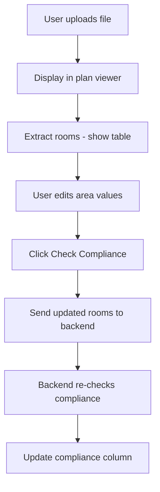
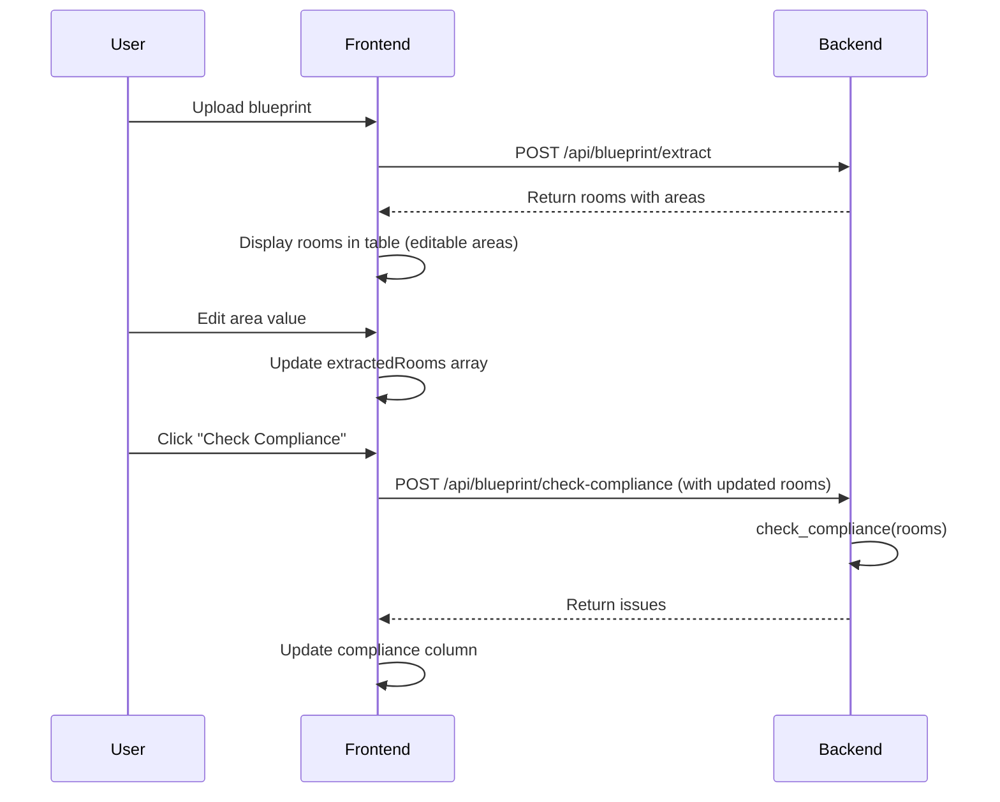

# UI Improvements for Blueprint Extraction

## Overview

This plan implements 5 UI improvements to enhance the blueprint extraction and compliance checking workflow:

1. **Empty Plan Viewer**: Show empty/placeholder until file is uploaded
2. **Editable Area Column**: Allow users to edit area values and re-check compliance
3. **Conditional Compliance Column**: Show compliance column only after first compliance check
4. **Hide Type/Level Columns**: Remove type and level columns from UI
5. **Fix Tooltip Z-Index**: Ensure compliance tooltips appear above table header

## Architecture

## Implementation Details

### 1. Empty Plan Viewer Until Upload

**File**: `backend/app/templates/index.html`

- **Change default image**: Replace `src="/static/plan.png"` with empty/placeholder
  - Option A: Use `data:image/svg+xml` placeholder with "Upload a blueprint to view" message
  - Option B: Set `src=""` and show placeholder text via CSS `::before` pseudo-element
- **Update `displayUploadedBlueprint()`**: Ensure it only runs when a file is actually uploaded
- **Initial state**: Show placeholder message: "Upload a blueprint file to view the floor plan"

**Location**: Line 110 - ``

### 2. Editable Area Column

**Files**:

- `backend/app/templates/index.html` (frontend)
- `backend/app/api/blueprint.py` (backend - new endpoint)

**Frontend Changes**:

- **Make area cell editable**: Replace `<td>${room.area_m2.toFixed(1)}</td>` with an `<input>` element
  - Use `<input type="number" step="0.1" min="0" value="${room.area_m2.toFixed(1)}" data-room-id="${room.id}" class="area-input">`
  - Add event listener to track changes: `onchange` or `onblur` to update `extractedRooms` array
- **Store edited values**: Maintain `extractedRooms` array with original + edited values
- **Update compliance check**: When "Check Compliance" is clicked, send updated room data

**Backend Changes**:

- **New endpoint**: `POST /api/blueprint/check-compliance/` 
  - Accepts: `rooms: List[Room]` (JSON body)
  - Returns: `{"issues": List[Issue], "summary": dict}`
  - Uses existing `check_compliance()` function from `app/services/compliance_checker.py`
- **Alternative**: Modify existing `/extract-and-check/` to accept optional `rooms_override` parameter
  - If provided, skip extraction and use provided rooms for compliance checking

**Location**:

- Frontend: Line 862 in `displayExtractionResults()`
- Backend: New endpoint in `backend/app/api/blueprint.py`

### 3. Conditional Compliance Column Visibility

**File**: `backend/app/templates/index.html`

- **Hide initially**: Add CSS class `compliance-column-hidden` to `<th>Compliance</th>` and hide via CSS
- **Show on first check**: When `checkComplianceAndGenerateOverlays()` completes successfully:
  - Remove `compliance-column-hidden` class from header
  - Show all compliance `<td>` cells (they're already rendered, just hidden)
- **Track state**: Use a flag `complianceChecked = false` to track if compliance has been checked
- **CSS**: `.compliance-column-hidden { display: none; }`

**Locations**:

- Table header: Line 148
- Table cells: Line 865 (already rendered, just need to show/hide)
- JavaScript: `checkComplianceAndGenerateOverlays()` function around line 879

### 4. Hide Type and Level Columns

**File**: `backend/app/templates/index.html`

- **Remove from table header**: Remove `<th>Type</th>` and `<th>Level</th>` (lines 144, 146)
- **Remove from table body**: Remove `<td>${escapeHtml(room.type)}</td>` and `<td>${room.level}</td>` (lines 861, 863)
- **Keep in data**: Room objects still contain `type` and `level` for compliance checking logic

**Locations**:

- Table header: Lines 144, 146
- Table body: Lines 861, 863

### 5. Fix Tooltip Z-Index

**File**: `backend/app/templates/index.html`

- **Issue**: Tooltip has `z-index: 1000` but table header might have higher stacking context
- **Solution**: 
  - Increase tooltip z-index: Change from `z-index: 1000` to `z-index: 10000`
  - Ensure table has `position: relative` to create stacking context
  - Add `pointer-events: none` to tooltip `::after` to prevent interaction issues
  - Consider using `position: fixed` instead of `absolute` if table scrolling causes issues

**Location**: Line 81 - `.room-issues-tooltip:hover::after` CSS rule

## Data Flow for Editable Areas

## Files to Modify

1. **`backend/app/templates/index.html`**

   - Line 110: Change default plan image to placeholder
   - Lines 144, 146: Remove Type and Level column headers
   - Line 148: Add conditional visibility class to Compliance header
   - Line 81: Fix tooltip z-index
   - Line 862: Make area cell editable input
   - Line 865: Add conditional visibility to compliance cell
   - Line 879: Update `checkComplianceAndGenerateOverlays()` to send edited rooms
   - Add new function: `updateRoomArea(roomId, newArea)` to track edits

2. **`backend/app/api/blueprint.py`**

   - Add new endpoint: `POST /api/blueprint/check-compliance/`
   - Accept `List[Room]` in request body
   - Call `check_compliance()` and return issues + summary

## Testing Checklist

- [ ] Plan viewer shows placeholder until file uploaded
- [ ] Area values are editable in table
- [ ] Edited area values persist when re-checking compliance
- [ ] Compliance column hidden initially, appears after first check
- [ ] Type and Level columns are removed from UI
- [ ] Tooltip appears above table header without being cut off
- [ ] Compliance checking works with edited area values
- [ ] Original extraction still works correctly

## Edge Cases

- **Empty area input**: Validate that area is > 0, show error message
- **Non-numeric input**: Prevent or validate numeric input only
- **Multiple compliance checks**: Ensure compliance column stays visible after first check
- **File re-upload**: Reset compliance state when new file is uploaded
- **Table scrolling**: Ensure tooltip positioning works when table is scrolled

## Future Considerations

- Consider adding "Reset to Original" button to restore original extracted values
- Consider adding validation feedback (green checkmark when area is compliant)
- Consider adding "Save Changes" button to persist edited values