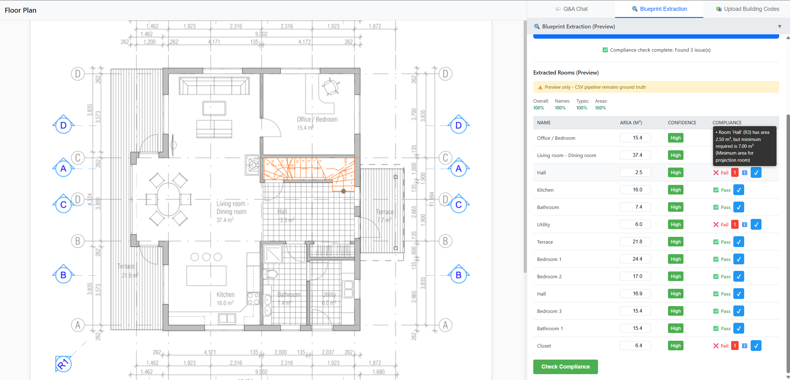
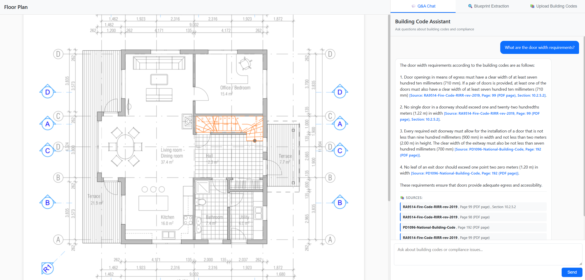
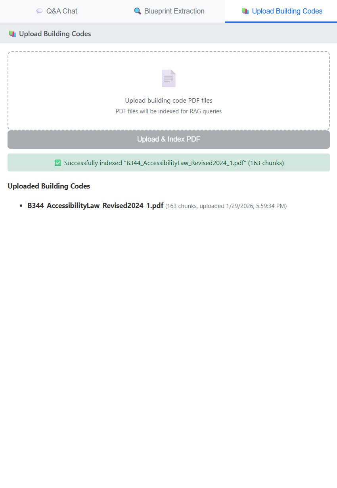
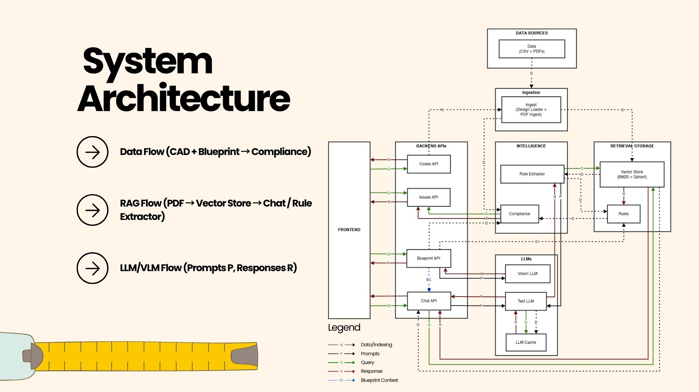

# Code-Aware Space Planning Copilot

**AI-powered building code compliance for AEC.** This project helps architects and designers check early space planning (rooms, doors, corridors) against building codes and internal standards, without relying on full BIM. It combines **Vision LLMs** (blueprint extraction), **RAG** (building code Q&A with citations), and **deterministic compliance checking** in a single proof-of-concept aimed at future CAD Add-In integration (AutoCAD/Revit).

## 🎥 Watch the 7-Minute Demo

<p align="center">
  <a href="https://youtu.be/Gm1t-kPv15Q">
    
  </a>
</p>
- **Full architecture and slides:** [Canva Slides](https://www.canva.com/design/DAHAK-zQZo4/Bf9FJV1Vd4NpEQHfbraE_w/view?utm_content=DAHAK-zQZo4&utm_campaign=designshare&utm_medium=link2&utm_source=uniquelinks&utlId=h9854f73c16)

## Highlights (for recruiters and hiring managers)

- **End-to-end AI/LLM product:** RAG over building code PDFs (BM25 retrieval validated with RAGAS), Vision LLM for blueprint room extraction (Gemini 2.0 Flash selected via evaluation), conversational chat with blueprint context, and deterministic compliance with LLM-extracted rules.
- **Production-minded:** 16/16 end-to-end tests passing, deployed to Railway, structured APIs (FastAPI), Pydantic models, and clear separation (api / services / models / core).
- **Evaluated choices:** BM25-only retrieval chosen over hybrid/dense (RAGAS composite 0.422); Gemini 2.0 Flash chosen over GPT-4o for VLM (composite 0.753, better recall and latency). No black-box prompts—compliance logic is auditable (rules from seed + PDF extraction; numeric checks are deterministic).
- **Scope:** Single-page UI (HTML/CSS/JS), three tabs (Q&A Chat, Blueprint Extraction, Upload Building Codes). CSV and standalone UI are proxies for future CAD data and embedded Add-In UI.

## Overview

This MVP delivers three main capabilities:

1. **VLM-based blueprint extraction and integrated compliance** — Extract structured room data from blueprint images using a Vision LLM (Gemini 2.0 Flash default). Editable area fields let users correct results; deterministic compliance checks run against a rule set (seeded + LLM-extracted from building code PDFs).

2. **Conversational RAG over building codes** — Pre-loaded and user-uploaded PDFs are chunked, embedded, and stored; chat provides Q&A with citations and optional blueprint context (conversation history and extracted rooms).

3. **PDF upload for custom building codes** — Users can upload building code PDFs; they are indexed immediately for RAG and included in rule extraction for compliance (multi-jurisdiction support).


## Tech Stack

**Backend:**
- Python 3.11+
- FastAPI + uvicorn
- LangChain for LLM orchestration (RAG, rule extraction, chat)
- Qdrant in-memory for vector storage; BM25 retrieval (validated via RAGAS; no FAISS in current setup)
- OpenAI for text (RAG, rule extraction); Gemini 2.0 Flash (default) or GPT-4o for vision (blueprint extraction)

**Frontend:**
- Plain HTML + CSS + vanilla JavaScript
- Single-page UI served directly by FastAPI
- No Node/npm, no React, no build toolchain

## Architecture

High-level flow: data (CSV + PDFs) is ingested into a vector store and used by compliance and RAG; the frontend talks to Chat, Codes, Blueprint, and Issues APIs; Text LLM and Vision LLM handle RAG/rule extraction and blueprint extraction respectively. Legend: **D** = data/indexing, **P** = prompts, **Q** = query, **R** = response, **BC** = blueprint context.

<p align="center">
  
</p>

For the detailed diagram (all nodes and legend), see [docs/architecture-diagram.md](docs/architecture-diagram.md).

## Quick Start

### Prerequisites

- Python 3.11 or 3.12
- [uv](https://github.com/astral-sh/uv) package manager

### Setup

1. Install dependencies:
```bash
cd backend
uv sync
```

2. Set up environment variables (create `.env` in `backend/`):
```bash
# LLM Provider (choose one for text-based operations)
OPENAI_API_KEY=your_key_here
# or
GEMINI_API_KEY=your_key_here
# or
ANTHROPIC_API_KEY=your_key_here

# Vision LLM Configuration (for blueprint extraction)
# Provider: "openai" (GPT-4o) or "gemini" (Gemini 2.0 Flash, default)
VISION_LLM_PROVIDER=gemini

# Vision LLM API Keys (required if using vision features)
# For OpenAI (GPT-4o): Use OPENAI_API_KEY above
# For Gemini: Use GOOGLE_API_KEY below
GOOGLE_API_KEY=your_key_here  # Required if VISION_LLM_PROVIDER=gemini

# Qdrant (optional, defaults to in-memory)
QDRANT_URL=http://localhost:6333
QDRANT_API_KEY=your_key_here
```

3. Run the backend:
```bash
cd backend
uv run uvicorn app.main:app --reload
```

4. Open browser: `http://localhost:8000`

## Project Structure

```
backend/
├── app/
│   ├── api/          # FastAPI route handlers
│   ├── services/     # Business logic (CSV loaders, compliance checker, RAG)
│   ├── models/       # Pydantic domain models (Room, Door, Rule, Issue)
│   ├── core/         # LLM client abstraction, config
│   ├── data/         # Input files (CSV schedules, PDFs, overlays.json)
│   ├── static/       # Static assets (plan.png, styles.css)
│   ├── templates/    # HTML templates (index.html)
│   └── main.py       # FastAPI app entry point
├── pyproject.toml    # Dependencies (uv)
└── uv.lock          # Lock file

memory-bank/          # Project documentation and context
docs/                 # Additional documentation
```

## Data Files

Place your project data in `backend/app/data/`:

- `rooms.csv` - Room schedule (id, name, type, level, area_m2)
- `doors.csv` - Door schedule (id, location_room_id, clear_width_mm, level)
- `code_sample.pdf` - Building code PDFs
- `overlays.json` - Room/door polygon overlays for plan viewer

## Development

### Project Status

**MVP complete.** Proof-of-concept CAD Add-In (CSV and standalone web UI as proxy). Presentation delivered; project closed.

Key docs: `docs/architecture-diagram.md`, `docs/presentation-slides.md`, `docs/demo-script.md`.

### Current Status

**Implemented (MVP):**
- CSV loaders for rooms and doors; domain models (Room, Door, Rule, Issue); compliance checker
- `GET /api/issues/`, `GET /api/issues/summary` — list compliance issues
- PDF ingest, vector store (BM25-only default, validated via RAGAS), rule extraction with project context
- `POST /api/chat/` — conversational RAG with citations and optional blueprint context
- Blueprint extraction (VLM): `POST /api/blueprint/extract/`, `POST /api/blueprint/extract-and-check/`, `POST /api/blueprint/check-compliance/` — editable areas, compliance on extracted rooms
- `POST /api/codes/upload/` — upload building code PDFs (persistent storage, immediate RAG and rule extraction)
- Frontend: plan viewer, issues list, three tabs (Q&A Chat, Blueprint Extraction, Upload Building Codes)

See `memory-bank/progress.md` for detailed status.

### Code Patterns

- **API routes**: `app/api/*.py`, mounted via `include_router` in `main.py`
- **Services**: `app/services/*.py` encapsulate business logic
- **Models**: Pydantic models in `app/models/domain.py`
- **Frontend**: Single HTML template served by FastAPI, vanilla JS for interactivity

## API Endpoints

- `GET /health` — Health check
- `GET /` — Frontend UI (HTML template)
- `GET /api/issues/` — List compliance issues
- `GET /api/issues/summary` — Compliance issue summary
- `POST /api/chat/` — Conversational chat with RAG and optional blueprint context
- `POST /api/codes/upload/` — Upload building code PDF (indexed for RAG and rule extraction)
- `POST /api/blueprint/extract/` — Extract room data from blueprint image/PDF
- `POST /api/blueprint/extract-and-check/` — Extract rooms and run compliance check
- `POST /api/blueprint/check-compliance/` — Run compliance check on provided room list (e.g. edited areas)

## Blueprint Extraction

The system uses a Vision LLM to extract structured room data from blueprint images. **Default model: Gemini 2.0 Flash** (evaluation-selected); OpenAI GPT-4o is available as an alternative.

### Features

- **Semantic understanding**: VLM reads room labels, classifies types, and associates dimensions with rooms
- **Integrated compliance**: Extracted rooms feed deterministic compliance checks (rules from seeded + LLM-extracted PDFs); editable area fields let users correct results before re-checking
- **Multi-format support**: Accepts PNG, JPG, or PDF blueprints; multi-page PDFs combined or per-page
- **Structured output**: Room models (name, type, area, level) returned for compliance and chat context

### Usage

1. Upload a blueprint image via the frontend (Blueprint Extraction tab)
2. Optionally specify scale factor (default 1.0 for 1:100)
3. Edit area values if needed, then run "Check Compliance" on the extracted (or edited) room list
4. Use Q&A Chat with blueprint context to ask about specific rooms

### Configuration

Set vision LLM provider in `.env`:

```bash
# Default: Gemini 2.0 Flash (evaluation-selected)
VISION_LLM_PROVIDER=gemini  # or "openai" for GPT-4o

# API keys (required)
GOOGLE_API_KEY=your_key_here   # For Gemini 2.0 Flash
OPENAI_API_KEY=your_key_here   # For GPT-4o (if using openai)
```

### Limitations

- Areas are approximate (depends on scale assumption)
- Works best with clear, labeled blueprints
- Room extraction only (no door extraction in MVP)
- **Deferred:** Visual issue highlighting on plan (backend/overlays ready, frontend rendering deferred); VLM label overlay rendering in plan viewer deferred

### Evaluation (Gemini 2.0 Flash default)

- Composite score: 0.753 (vs GPT-4o 0.743); recall 69.66%; latency ~7.6s
- See `evaluation/results/vlm_evaluation_results.json` and `backend/app/tests/CURATED_PLAN_TEST_RESULTS.md` for full metrics

## Constraints

- **Units**: Always SI units (m, m², mm). Be explicit when converting.
- **Rules**: Never invent building code rules. Use only:
  1. Seeded Rule models
  2. Text from code PDFs via RAG
- **Frontend**: No build toolchain. Plain HTML/CSS/JS served by FastAPI.

## Deployment

### Railway.app (Recommended for Demo)

1. Push your code to GitHub
2. Go to [Railway.app](https://railway.app) and sign in
3. Click "New Project" → "Deploy from GitHub repo"
4. Select your repository
5. Add environment variable: `OPENAI_API_KEY` (in Railway dashboard → Variables)
6. Railway will auto-detect Python and deploy
7. Your app will be live at `https://your-app.railway.app`

**Note**: The project includes `railway.json` for automatic configuration.

### Docker

```bash
cd backend
docker build -t space-code-copilot .
docker run -p 8000:8000 -e OPENAI_API_KEY=your_key space-code-copilot
```

### Local Demo

For assessors to run locally:

```bash
# Clone repo
git clone <your-repo-url>
cd space-code-copilot/backend

# Install dependencies
uv sync

# Copy environment template
cp .env.example .env
# Edit .env and add your OPENAI_API_KEY

# Run
uv run uvicorn app.main:app --reload

# Open http://localhost:8000
```

See `DEPLOYMENT.md` for detailed deployment instructions.

## Documentation

- `memory-bank/` — Project context, patterns, and progress tracking
- `DEPLOYMENT.md` — Deployment guide for assessors
- `docs/architecture-diagram.md` — System architecture (detailed and simplified)
- `docs/presentation-slides.md` — Presentation slides and Q&A prep
- `docs/demo-script.md` — Demo flow
- `docs/PRD.md` — Product requirements; `docs/demo-data-verification.md` — Demo data notes

## License

See `LICENSE` file.

