# Architecture Diagram - Code-Aware Space Planning Copilot

## Important Context: CAD Add-In Architecture

**This MVP is a proof-of-concept Add-In for CAD software (AutoCAD/Revit).**

- **CSV Files**: Proxy for data that would come directly from CAD software (AutoCAD/Revit) in production
- **Standalone Web UI**: Proxy for the UI that would be embedded within CAD software as an Add-In
- **Future Integration**: The MVP demonstrates core functionality that would integrate directly into CAD software

## System Architecture

```mermaid
flowchart LR
  %% ---------- Nodes ----------
  CSV["CSV Files\n(rooms.csv,\ndoors.csv)\n[CAD Data Proxy]"]
  PDF["Building Code\nPDFs"]
  
  DLOAD["Design Loader\n(@lru_cache)"]
  PINGEST["PDF Ingest\n(PyMuPDFLoader,\nTextSplitter)"]
  
  EM["Embedding Model\n(OpenAI)"]
  VDB["Vector Store\n(BM25 + Qdrant\nin-memory)"]
  
  RULES["Rules\n(Seeded +\nLLM-extracted)"]
  COMP["Compliance\nChecker"]
  RULEX["Rule Extractor\n(LLM-based)"]
  
  CHATAPI["Chat API\n(RAG Endpoint)"]
  ISSUESAPI["Issues API"]
  
  FRONT["Frontend UI\n(HTML/CSS/JS)\n[CAD UI Proxy]"]
  PLAN["Plan Viewer\n(Overlays)"]
  ISSUES["Issues List"]
  CHAT["Chat Panel"]
  
  LLM["LLM Client\n(OpenAI/Gemini\nAbstraction)"]
  CACHE["LLM Cache\n(SQLite/Memory)"]
  LOG["Logging\n(Optional)"]
  
  subgraph HOST["LLM Hosting"]
    OPENAI["OpenAI API"]
    GEMINI["Gemini API\n(Placeholder)"]
  end
  
  %% ---------- Contextual / indexing (dashed gray) - D ----------
  CSV -.->|D| DLOAD
  DLOAD -.->|D| COMP
  COMP -.->|D| ISSUESAPI
  PDF -.->|D| PINGEST
  PINGEST -.->|D| EM
  EM -.->|D| VDB
  VDB -.->|D| RULEX
  VDB -.->|D| CHATAPI
  RULEX -.->|D| RULES
  RULES -.->|D| COMP
  
  %% ---------- Prompts (black) - P ----------
  RULEX -->|P| LLM
  CHATAPI -->|P| LLM
  
  %% ---------- Query path through retrieval (blue) - Q ----------
  CHATAPI -->|Q| VDB
  RULEX -->|Q| VDB
  VDB -->|Q| EM
  
  %% ---------- User query + app hosting (blue in / red out) - Q/A ----------
  FRONT -->|Q| CHATAPI
  FRONT -->|Q| ISSUESAPI
  COMP -->|Q| ISSUESAPI
  ISSUESAPI -->|A| FRONT
  CHATAPI -->|A| FRONT
  
  FRONT -->|Q| PLAN
  FRONT -->|Q| ISSUES
  FRONT -->|Q| CHAT
  
  %% ---------- Orchestration ↔ Cache (dashed/blue/red) - D/Q/A ----------
  LLM -.->|D| CACHE
  LLM -->|Q| CACHE
  CACHE -->|A| LLM
  
  %% ---------- Cache ↔ LLM API (dashed/blue/red) - D/Q/A ----------
  CACHE -.->|D| OPENAI
  CACHE -->|Q| OPENAI
  OPENAI -->|A| CACHE
  
  %% ---------- Orchestration ↔ Logging (dashed/blue/red) - D/Q/A ----------
  LLM -.->|D| LOG
  LLM -->|Q| LOG
  LOG -->|A| LLM
  
  %% ---------- Hosting internal relationships (dashed) - D ----------
  OPENAI -.->|D| HOST
  GEMINI -.->|D| HOST
  
  %% ---------- Legend ----------
  subgraph LEGEND["LEGEND"]
    L1((D))
    T1["Contextual data (dashed gray)"]
    L2((P))
    T2["Prompts / LLM calls (black)"]
    L3((Q))
    T3["Queries / Requests (blue)"]
    L4((A))
    T4["Outputs / Responses (red)"]
    L1 -.->|D| T1
    L2 -->|P| T2
    L3 -->|Q| T3
    L4 -->|A| T4
  end
  
  %% ---------- Styling ----------
  classDef box fill:#efefef,stroke:#bbb,stroke-width:1px,color:#111;
  class CSV,PDF,DLOAD,PINGEST,EM,VDB,RULES,COMP,RULEX,CHATAPI,ISSUESAPI,FRONT,PLAN,ISSUES,CHAT,LLM,CACHE,LOG,OPENAI,GEMINI box;
```

## Component Breakdown

### Data Flow
1. **CAD Software (CSV Proxy)** → Design Loader → Compliance Checker → Issues API
   - In production: CAD software (AutoCAD/Revit) exports design data directly
   - MVP: CSV files represent this exported data

### RAG Flow
2. **PDF** → PDF Ingest → Embedding Model → Vector Store → Chat API
   - Building code PDFs are ingested, chunked, and embedded
   - BM25 retrieval (validated best technique) for building code questions

### LLM Flow
3. **Rule Extractor/Chat API** → LLM Client → Cache → OpenAI API
   - LLM calls for rule extraction and RAG-based chat
   - Caching reduces API costs and latency

### Frontend Components (CAD UI Proxy)
4. **Plan Viewer, Issues List, Chat Panel**
   - In production: Embedded within CAD software UI
   - MVP: Standalone web UI demonstrates Add-In functionality

## Edge Type Legend

- **D (Dashed Gray)**: Contextual data/indexing flows
  - Data ingestion, embedding, rule extraction context
  
- **P (Black)**: Prompts/LLM calls
  - Direct LLM API calls for rule extraction and chat
  
- **Q (Blue)**: Queries/Requests
  - User queries, API requests, retrieval operations
  
- **A (Red)**: Outputs/Responses
  - API responses, LLM outputs, cache hits

## Key Design Decisions

1. **BM25-Only Retrieval**: Validated via RAGAS evaluation (composite score: 0.422)
   - Building codes benefit from exact term matching over semantic similarity
   
2. **Project Context Filtering**: Rules filtered by building type, stories, occupancy
   - Reduces irrelevant rules (28 issues → 3 issues)
   
3. **Dual Page Numbers**: PDF page vs. document page
   - Citations explicitly indicate page type for accuracy
   
4. **Caching Strategy**: 
   - CSV: `@lru_cache` for file-based caching
   - Embeddings: File-based cache
   - LLM: SQLite/Memory cache

## Future Integration

**Production Add-In Architecture:**
- Direct integration with AutoCAD/Revit APIs
- Real-time design data extraction (no CSV export needed)
- Embedded UI panels within CAD software
- Native CAD file format support (DWG, RVT)

