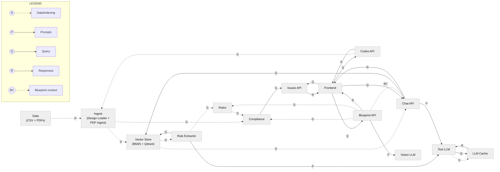

# Architecture Diagram - Code-Aware Space Planning Copilot

## Important Context: CAD Add-In Architecture

**This MVP is a proof-of-concept Add-In for CAD software (AutoCAD/Revit).**

- **CSV Files**: Proxy for data that would come directly from CAD software (AutoCAD/Revit) in production
- **Standalone Web UI**: Proxy for the UI that would be embedded within CAD software as an Add-In
- **Future Integration**: The MVP demonstrates core functionality that would integrate directly into CAD software

## System Architecture

```mermaid
flowchart LR
  %% ---------- Nodes ----------
  CSV["CSV Files\n(rooms.csv,\ndoors.csv)\n[CAD Data Proxy]"]
  PDF["Building Code\nPDFs\n(Pre-loaded)"]
  PDFUP["Uploaded PDFs\n(app/data/uploads/)"]
  
  DLOAD["Design Loader\n(@lru_cache)"]
  PINGEST["PDF Ingest\n(PyMuPDFLoader,\nTextSplitter)"]
  
  EM["Embedding Model\n(OpenAI)"]
  VDB["Vector Store\n(BM25 + Qdrant\nin-memory)"]
  
  RULES["Rules\n(Seeded +\nLLM-extracted)"]
  COMP["Compliance\nChecker"]
  RULEX["Rule Extractor\n(LLM-based)"]
  
  CHATAPI["Chat API\n(Conversational RAG)"]
  CONVSTORE["Conversation\nStorage\n(In-memory)"]
  CODESAPI["Codes API\n(PDF Upload)"]
  BLUEPRINTAPI["Blueprint API\n(Room Extraction)"]
  ISSUESAPI["Issues API"]
  
  FRONT["Frontend UI\n(HTML/CSS/JS)\n[CAD UI Proxy]"]
  PLAN["Plan Viewer\n(Overlays)"]
  ISSUES["Issues List"]
  CHAT["Chat Panel\n(Conversational)"]
  BLUEPRINT["Blueprint\nExtraction Tab"]
  UPLOAD["Upload Codes\nTab"]
  
  LLM["Text LLM Client\n(OpenAI/Gemini\nfor RAG & Rules)"]
  VLM["Vision LLM Client\n(Gemini 2.0 Flash\nDefault)"]
  CACHE["LLM Cache\n(SQLite/Memory)"]
  LOG["Logging\n(Optional)"]
  
  subgraph HOST["LLM Hosting"]
    OPENAI["OpenAI API\n(GPT-4o)"]
    GEMINI["Gemini API\n(Gemini 2.0 Flash)"]
  end
  
  %% ---------- Contextual / indexing (dashed gray) - D ----------
  CSV -.->|D| DLOAD
  DLOAD -.->|D| COMP
  COMP -.->|D| ISSUESAPI
  PDF -.->|D| PINGEST
  PDFUP -.->|D| PINGEST
  PINGEST -.->|D| EM
  EM -.->|D| VDB
  VDB -.->|D| RULEX
  VDB -.->|D| CHATAPI
  RULEX -.->|D| RULES
  RULES -.->|D| COMP
  CODESAPI -.->|D| PDFUP
  CODESAPI -.->|D| PINGEST
  CHATAPI -.->|D| CONVSTORE
  CONVSTORE -.->|D| CHATAPI
  BLUEPRINTAPI -.->|D| COMP
  BLUEPRINTAPI -.->|D| RULES
  
  %% ---------- Prompts (black) - P ----------
  RULEX -->|P| LLM
  CHATAPI -->|P| LLM
  BLUEPRINTAPI -->|P| VLM
  
  %% ---------- Query path through retrieval (blue) - Q ----------
  CHATAPI -->|Q| VDB
  RULEX -->|Q| VDB
  VDB -->|Q| EM
  
  %% ---------- User query + app hosting (blue in / red out) - Q/R ----------
  FRONT -->|Q| CHATAPI
  FRONT -->|Q| CODESAPI
  FRONT -->|Q| BLUEPRINTAPI
  FRONT -->|Q| ISSUESAPI
  COMP -->|Q| ISSUESAPI
  ISSUESAPI -->|R| FRONT
  CHATAPI -->|R| FRONT
  CODESAPI -->|R| FRONT
  BLUEPRINTAPI -->|R| FRONT
  
  FRONT -->|Q| PLAN
  FRONT -->|Q| ISSUES
  FRONT -->|Q| CHAT
  FRONT -->|Q| BLUEPRINT
  FRONT -->|Q| UPLOAD
  
  %% ---------- Blueprint context flow (green) - BC ----------
  BLUEPRINT -.->|BC| CHAT
  CHAT -.->|BC| CHATAPI
  BLUEPRINTAPI -.->|BC| BLUEPRINT
  
  %% ---------- Orchestration ↔ Cache (dashed/blue/red) - D/Q/R ----------
  LLM -.->|D| CACHE
  LLM -->|Q| CACHE
  CACHE -->|R| LLM
  
  %% ---------- Cache ↔ LLM API (dashed/blue/red) - D/Q/R ----------
  CACHE -.->|D| OPENAI
  CACHE -->|Q| OPENAI
  OPENAI -->|R| CACHE
  VLM -->|Q| GEMINI
  GEMINI -->|R| VLM
  LLM -->|Q| OPENAI
  LLM -->|Q| GEMINI
  OPENAI -->|R| LLM
  GEMINI -->|R| LLM
  
  %% ---------- Orchestration ↔ Logging (dashed/blue/red) - D/Q/R ----------
  LLM -.->|D| LOG
  LLM -->|Q| LOG
  LOG -->|R| LLM
  VLM -.->|D| LOG
  VLM -->|Q| LOG
  LOG -->|R| VLM
  
  %% ---------- Hosting internal relationships (dashed) - D ----------
  OPENAI -.->|D| HOST
  GEMINI -.->|D| HOST
  
  %% ---------- Legend ----------
  subgraph LEGEND["LEGEND"]
    L1((D))
    T1["Contextual data (dashed gray)"]
    L2((P))
    T2["Prompts / LLM calls (black)"]
    L3((Q))
    T3["Queries / Requests (blue)"]
    L4((R))
    T4["Responses (red)"]
    L5((BC))
    T5["Blueprint context (dashed green)"]
    L1 -.->|D| T1
    L2 -->|P| T2
    L3 -->|Q| T3
    L4 -->|R| T4
    L5 -.->|BC| T5
  end
  
  %% ---------- Styling ----------
  classDef box fill:#efefef,stroke:#bbb,stroke-width:1px,color:#111;
  class CSV,PDF,PDFUP,DLOAD,PINGEST,EM,VDB,RULES,COMP,RULEX,CHATAPI,CONVSTORE,CODESAPI,BLUEPRINTAPI,ISSUESAPI,FRONT,PLAN,ISSUES,CHAT,BLUEPRINT,UPLOAD,LLM,VLM,CACHE,LOG,OPENAI,GEMINI box;
```

### Simplified Architecture (same flows, fewer nodes)

```mermaid
flowchart LR
  %% ---------- Simplified nodes ----------
  DATA["Data\n(CSV + PDFs)"]
  INGEST["Ingest\n(Design Loader +\nPDF Ingest)"]
  VDB2["Vector Store\n(BM25 + Qdrant)"]
  RULES2["Rules"]
  COMP2["Compliance"]
  RULEX2["Rule Extractor"]
  CHATAPI2["Chat API"]
  CODESAPI2["Codes API"]
  BLUEPRINTAPI2["Blueprint API"]
  ISSUESAPI2["Issues API"]
  FRONT2["Frontend"]
  LLM2["Text LLM"]
  VLM2["Vision LLM"]
  CACHE2["LLM Cache"]

  %% ---------- Data/indexing (D) ----------
  DATA -.->|D| INGEST
  INGEST -.->|D| VDB2
  INGEST -.->|D| COMP2
  VDB2 -.->|D| RULEX2
  VDB2 -.->|D| CHATAPI2
  RULEX2 -.->|D| RULES2
  RULES2 -.->|D| COMP2
  CODESAPI2 -.->|D| INGEST
  BLUEPRINTAPI2 -.->|D| COMP2
  BLUEPRINTAPI2 -.->|D| RULES2

  %% ---------- Prompts (P) ----------
  RULEX2 -->|P| LLM2
  CHATAPI2 -->|P| LLM2
  BLUEPRINTAPI2 -->|P| VLM2

  %% ---------- Query / retrieval (Q) ----------
  CHATAPI2 -->|Q| VDB2
  RULEX2 -->|Q| VDB2

  %% ---------- User request/response (Q/R) ----------
  FRONT2 -->|Q| CHATAPI2
  FRONT2 -->|Q| CODESAPI2
  FRONT2 -->|Q| BLUEPRINTAPI2
  FRONT2 -->|Q| ISSUESAPI2
  COMP2 -->|Q| ISSUESAPI2
  ISSUESAPI2 -->|R| FRONT2
  CHATAPI2 -->|R| FRONT2
  CODESAPI2 -->|R| FRONT2
  BLUEPRINTAPI2 -->|R| FRONT2

  %% ---------- Blueprint context (BC) ----------
  BLUEPRINTAPI2 -.->|BC| CHATAPI2

  %% ---------- LLM ↔ Cache (D/Q/R) ----------
  LLM2 -.->|D| CACHE2
  LLM2 -->|Q| CACHE2
  CACHE2 -->|R| LLM2

  %% ---------- Legend ----------
  subgraph LEGEND2["LEGEND"]
    direction LR
    L1((D)) -.-> T1["Data/indexing"]
    L2((P)) --> T2["Prompts"]
    L3((Q)) --> T3["Query"]
    L4((R)) --> T4["Responses"]
    L5((BC)) -.-> T5["Blueprint context"]
  end

  classDef box fill:#efefef,stroke:#bbb,stroke-width:1px,color:#111;
  class DATA,INGEST,VDB2,RULES2,COMP2,RULEX2,CHATAPI2,CODESAPI2,BLUEPRINTAPI2,ISSUESAPI2,FRONT2,LLM2,VLM2,CACHE2 box;
```

#### Simplified diagram verification (vs codebase)

| Element | Diagram | Codebase | Status |
|--------|---------|----------|--------|
| **Data** | CSV + PDFs (pre-loaded + uploads) | `app/data/` (rooms.csv, doors.csv, PD1096/RA9514 PDFs), `app/data/uploads/` | ✓ |
| **Ingest** | Design Loader + PDF Ingest | `design_loader.py` (@lru_cache), `pdf_ingest.py` (PyMuPDFLoader, TextSplitter) | ✓ |
| **Vector Store** | BM25 + Qdrant in-memory | `vector_store.py`: BM25Retriever + QdrantVectorStore, `use_memory=True` | ✓ |
| **Rules** | Seeded + LLM-extracted | `rules_seed.py`, `rule_extractor.py` (RAG + LLM) | ✓ |
| **Compliance** | Checker | `compliance_checker.py`, used by Issues API and Blueprint API | ✓ |
| **Rule Extractor** | LLM-based, uses VDB | `rule_extractor.py`: get_llm, VectorStore retrieval | ✓ |
| **Chat API** | Conversational RAG, conv storage | `api/chat.py`: `/api/chat`, `_conversations` in-memory, VectorStore, blueprint_context | ✓ |
| **Codes API** | PDF upload | `api/codes.py`: `/api/codes/upload/`, triggers ingest | ✓ |
| **Blueprint API** | Room extraction (VLM) | `api/blueprint.py`: `/api/blueprint/extract/`, `extract_rooms_from_blueprint`, VLM, compliance | ✓ |
| **Issues API** | Issues list | `api/issues.py`: `/api/issues/`, load_design → check_compliance | ✓ |
| **Frontend** | UI (Plan, Issues, Chat, Blueprint, Upload tabs) | `templates/index.html` + static (HTML/CSS/JS), plan viewer, issues list, chat panel, blueprint tab, upload tab | ✓ |
| **Text LLM** | OpenAI/Gemini for RAG & Rules | `core/llm.py`: `get_llm()` supports **OpenAI only** (Gemini for text not wired) | ⚠️ Diagram is aspirational for Gemini text |
| **Vision LLM** | Gemini 2.0 Flash default | `core/llm.py`: `get_vision_llm()` default provider `gemini`, model `gemini-2.0-flash` | ✓ |
| **LLM Cache** | SQLite/Memory | `core/llm.py`: `setup_llm_cache("memory")` in chat/rule_extractor | ✓ |
| **Blueprint context** | Blueprint → Chat | Chat request accepts `blueprint_context` (Room list); Blueprint tab feeds chat | ✓ |

**Note:** Conversation storage and Logging are implied in the simplified diagram (Chat API handles in-memory conversations; logging is optional). Text RAG and Rules use OpenAI only in the current code; the detailed diagram’s “OpenAI/Gemini for RAG & Rules” reflects possible future Gemini text support.

## Component Breakdown

### Data Flow
1. **CAD Software (CSV Proxy)** → Design Loader → Compliance Checker → Issues API
   - In production: CAD software (AutoCAD/Revit) exports design data directly
   - MVP: CSV files represent this exported data

### RAG Flow
2. **PDF (Pre-loaded + Uploaded)** → PDF Ingest → Embedding Model → Vector Store → Chat API
   - Pre-loaded building code PDFs in `app/data/*.pdf`
   - User-uploaded PDFs via `POST /api/codes/upload/` saved to `app/data/uploads/`
   - All PDFs are ingested, chunked, and embedded
   - BM25 retrieval (validated best technique) for building code questions
   - Uploaded PDFs immediately available for RAG queries and rule extraction

### LLM Flow
3. **Rule Extractor/Chat API** → LLM Client → Cache → OpenAI API
   - LLM calls for rule extraction and conversational RAG-based chat
   - Chat API maintains conversation history per conversation_id (in-memory)
   - Chat API integrates blueprint context (extracted rooms) for context-aware responses
   - Caching reduces API costs and latency

### Frontend Components (CAD UI Proxy)
4. **Plan Viewer, Issues List, Tabbed Right Panel**
   - **Left Panel**: Plan viewer with overlays
   - **Right Panel**: Three tabs:
     - "💬 Q&A Chat" - Conversational chat with blueprint context integration
     - "🔍 Blueprint Extraction" - Upload and extract rooms from blueprint images
     - "📚 Upload Building Codes" - Upload custom building code PDFs
   - In production: Embedded within CAD software UI
   - MVP: Standalone web UI demonstrates Add-In functionality

### PDF Upload Flow
5. **User Upload** → Codes API → PDF Ingest → Vector Store + Persistent Storage
   - User uploads PDF via Upload Building Codes tab
   - Codes API validates, ingests, and chunks PDF
   - PDF added to vector store for immediate RAG queries
   - PDF saved to `app/data/uploads/` for compliance rule extraction
   - Source metadata fixed to use actual filename (not temp filename)

### Blueprint Extraction Flow (VLM)
6. **Blueprint Image** → Blueprint API → Vision LLM → Extracted Rooms → Compliance Checker
   - User uploads blueprint image (PNG/JPG/PDF) via Blueprint Extraction tab
   - Blueprint API calls Vision LLM (Gemini 2.0 Flash, default)
   - VLM performs semantic understanding: reads room labels, classifies types, associates dimensions
   - Returns structured room data (name, type, area) with confidence scores
   - Extracted rooms can be checked for compliance
   - Extracted rooms passed to chat as blueprint context

### Conversational Chat Flow
7. **User Query** → Chat API → Conversation Storage → Text LLM (with history + blueprint context)
   - Chat API generates or retrieves conversation_id
   - Retrieves conversation history from in-memory storage
   - Integrates blueprint context (extracted rooms) if available
   - Includes conversation history and blueprint context in LLM prompt
   - Stores new messages in conversation history
   - Returns response with conversation_id for next message

## Edge Type Legend

- **D (Dashed Gray)**: Contextual data/indexing flows
  - Data ingestion, embedding, rule extraction context
  - PDF upload and indexing
  - Conversation storage
  
- **P (Black)**: Prompts/LLM calls
  - Direct LLM API calls for rule extraction and chat (Text LLM)
  - Direct VLM API calls for blueprint extraction (Vision LLM)
  
- **Q (Blue)**: Queries/Requests
  - User queries, API requests, retrieval operations
  
- **R (Red)**: Responses
  - API responses, LLM outputs, cache hits
  
- **BC (Dashed Green)**: Blueprint context flow
  - Extracted room data passed from Blueprint Extraction tab to Chat Panel
  - Blueprint context integrated into chat API requests

## Key Design Decisions

1. **BM25-Only Retrieval**: Validated via RAGAS evaluation (composite score: 0.422)
   - Building codes benefit from exact term matching over semantic similarity
   
2. **Project Context Filtering**: Rules filtered by building type, stories, occupancy
   - Reduces irrelevant rules (28 issues → 3 issues)
   
3. **Dual Page Numbers**: PDF page vs. document page
   - Citations explicitly indicate page type for accuracy
   
4. **Caching Strategy**: 
   - CSV: `@lru_cache` for file-based caching
   - Embeddings: File-based cache
   - LLM: SQLite/Memory cache

5. **Conversational Chat**: In-memory conversation storage per conversation_id
   - Maintains conversation history for follow-up questions
   - Integrates blueprint context (extracted rooms) for context-aware responses
   - Enables natural conversation flow (e.g., "What about bathrooms?" after asking about bedrooms)

6. **PDF Upload Integration**: Uploaded PDFs immediately available for both RAG and compliance
   - PDFs saved to persistent storage (`app/data/uploads/`) for rule extraction
   - PDFs indexed in vector store for immediate RAG queries
   - Source metadata uses actual filename (not temp filename) for accurate citations
   - Enables multi-jurisdiction support and custom code sets

7. **VLM-Based Blueprint Extraction**: Vision LLM (Gemini 2.0 Flash) for semantic room extraction
   - VLM performs semantic understanding (not just OCR)
   - Reads room labels, classifies types, associates dimensions with rooms
   - Selected via evaluation: Gemini 2.0 Flash (composite score: 0.753 vs GPT-4o's 0.743)
   - Better recall (69.66% vs 53.85%), faster latency (7.61s vs 13.53s), lower cost
   - Extracted rooms integrated with compliance checking and conversational chat

## Known Limitations & Deferred Features

**Backend Complete, Frontend Deferred:**
- ⏸️ **VLM Label Overlays Frontend Rendering**: Backend generates VLM label bounding boxes (`label_bbox`) alongside extracted rooms, but frontend rendering in plan viewer is deferred to future. Overlays are generated and returned in `BlueprintExtractionResult.overlays` but not yet displayed in the UI.

**Evaluation Deferred:**
- ⏸️ **Hugging Face VLM Evaluation**: HF VLM evaluation is deferred because it requires CUDA-capable GPU (uses Unsloth). Evaluation code exists (`evaluation/hf_vlm_wrapper.py`, `evaluation/vlm_evaluation_colab.py`) but requires GPU environment. Current VLM evaluation uses GPT-4o and Gemini 2.0 Flash (selected as default model based on evaluation).

**Future Recommendations:**
- Frontend overlay rendering: Integrate VLM overlays with existing overlay rendering system in `index.html`
- Visual highlighting: Display VLM-generated overlays on uploaded blueprint images
- Merge overlays: Intelligently combine VLM and OCR overlays (prefer VLM, fallback to OCR)
- HF VLM evaluation: Run in Colab or GPU environment when available
- **Blueprint Data Storage & Embedding**: Currently, blueprint extraction results (extracted rooms) are passed directly in chat requests as `blueprint_context`. For future multi-blueprint search capabilities, consider:
  - Embedding structured room data (name, type, area, level) for semantic search across multiple blueprints
  - Enabling queries like "Find all bedrooms larger than 20m² across all projects"
  - Cross-project room similarity search ("Find rooms similar to this office layout")
  - Historical blueprint analysis and comparison
  - **Note**: Current MVP uses direct pass-through (simpler, sufficient for single-blueprint sessions). Vector store embedding would require different strategy than text document embeddings (structured data vs. unstructured text). Consider separate structured data store (database) vs. vector store depending on use case.

## Future Integration

**Production Add-In Architecture:**
- Direct integration with AutoCAD/Revit APIs
- Real-time design data extraction (no CSV export needed)
- Embedded UI panels within CAD software
- Native CAD file format support (DWG, RVT)

